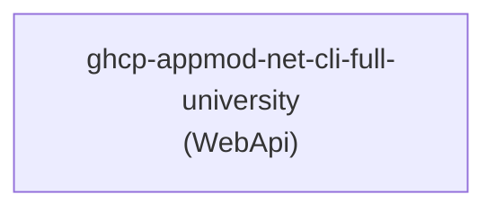

# Topology Graph: ghcp-appmod-net-cli-full-university

Analyzed 1 service(s) across 1 repository(ies) for application "ghcp-appmod-net-cli-full-university" on 2026-05-29 15:05 UTC.

## Services

## Service Details

| Service | Role | Language | Source Repository | Warnings |
|---------|------|----------|------------------|----------|
| ghcp-appmod-net-cli-full-university | WebApi | dotnet | ghcp-appmod-net-cli-full-university | — |
