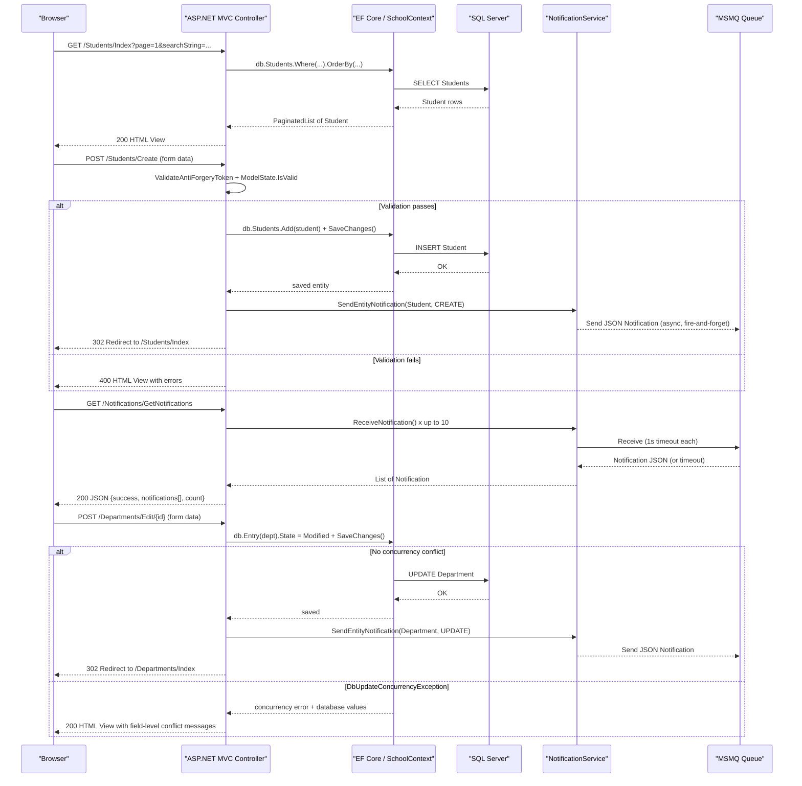

# API & Service Communication Contracts

This is a single-deployable ASP.NET MVC 5 web application exposing 27 server-rendered action endpoints plus 2 JSON API endpoints, all served over a conventional `{controller}/{action}/{id}` route with no API versioning scheme.

## Service Catalog

| Service | Port | Category | Purpose |
|---|---|---|---|
| ContosoUniversity (Web App) | 44300 (HTTPS / IIS Express), 58801 (HTTP dev) | Business | Server-rendered MVC web application for managing university students, courses, instructors, and departments |
| MSMQ (Private Queue) | N/A (local IPC) | Infrastructure | In-process message queue (`.\Private$\ContosoUniversityNotifications`) used to transport entity change notifications |
| SQL Server / LocalDB | 1433 (default) | Infrastructure | Relational data store accessed via Entity Framework Core 3.1 |

## API Endpoints Inventory

> Convention-based routing: `{controller}/{action}/{id?}`. All endpoints below derive from this default route. GET requests without `[HttpPost]` attribute are implicitly GET. HTML responses are Razor views; JSON responses are indicated separately.

| Controller | Method | Path | Request Type | Response Type | Notes |
|---|---|---|---|---|---|
| HomeController | GET | `/Home/Index` | — | HTML View | Landing page |
| HomeController | GET | `/Home/About` | — | HTML View (EnrollmentDateGroup list) | Enrollment statistics |
| HomeController | GET | `/Home/Contact` | — | HTML View | Contact page |
| HomeController | GET | `/Home/Error` | — | HTML View | Error page |
| HomeController | GET | `/Home/Unauthorized` | — | HTML View | 401 access-denied page |
| StudentsController | GET | `/Students/Index` | Query: `sortOrder`, `currentFilter`, `searchString`, `page` (int) | HTML View (PaginatedList of Student) | Supports sort, search, pagination |
| StudentsController | GET | `/Students/Details/{id}` | Path: `id` (int) | HTML View (Student) | Returns 400 if id null; 404 if not found |
| StudentsController | GET | `/Students/Create` | — | HTML View (Student) | |
| StudentsController | POST | `/Students/Create` | Form body: `LastName`, `FirstMidName`, `EnrollmentDate` (Student) | Redirect / HTML View | CSRF protected; returns 400 on validation failure |
| StudentsController | GET | `/Students/Edit/{id}` | Path: `id` (int) | HTML View (Student) | |
| StudentsController | POST | `/Students/Edit/{id}` | Form body: `ID`, `LastName`, `FirstMidName`, `EnrollmentDate` (Student) | Redirect / HTML View | CSRF protected |
| StudentsController | GET | `/Students/Delete/{id}` | Path: `id` (int) | HTML View (Student) | Confirmation page |
| StudentsController | POST | `/Students/Delete/{id}` | Path: `id` (int) | Redirect | CSRF protected; ActionName("Delete") |
| CoursesController | GET | `/Courses/Index` | — | HTML View (List of Course) | |
| CoursesController | GET | `/Courses/Details/{id}` | Path: `id` (int) | HTML View (Course) | |
| CoursesController | GET | `/Courses/Create` | — | HTML View (Course) | |
| CoursesController | POST | `/Courses/Create` | Form body: `CourseID`, `Title`, `Credits`, `DepartmentID`, `TeachingMaterialImagePath`; optional file upload `teachingMaterialImage` | Redirect / HTML View | CSRF protected; file upload max 5 MB, image types only |
| CoursesController | GET | `/Courses/Edit/{id}` | Path: `id` (int) | HTML View (Course) | |
| CoursesController | POST | `/Courses/Edit/{id}` | Form body: `CourseID`, `Title`, `Credits`, `DepartmentID`, `TeachingMaterialImagePath`; optional file upload `teachingMaterialImage` | Redirect / HTML View | CSRF protected; replaces existing file on disk |
| CoursesController | GET | `/Courses/Delete/{id}` | Path: `id` (int) | HTML View (Course) | Confirmation page |
| CoursesController | POST | `/Courses/Delete/{id}` | Path: `id` (int) | Redirect | CSRF protected; also deletes image file |
| InstructorsController | GET | `/Instructors/Index` | Query: `id` (int, optional), `courseID` (int, optional) | HTML View (InstructorIndexData) | |
| InstructorsController | GET | `/Instructors/Details/{id}` | Path: `id` (int) | HTML View (Instructor) | |
| InstructorsController | GET | `/Instructors/Create` | — | HTML View (Instructor) | |
| InstructorsController | POST | `/Instructors/Create` | Form body: `LastName`, `FirstMidName`, `HireDate`, `OfficeAssignment`; `selectedCourses[]` (string array) | Redirect / HTML View | CSRF protected |
| InstructorsController | GET | `/Instructors/Edit/{id}` | Path: `id` (int) | HTML View (Instructor) | |
| InstructorsController | POST | `/Instructors/Edit/{id}` | Path: `id` (int); Form: `selectedCourses[]` | Redirect / HTML View | CSRF protected; uses TryUpdateModel |
| InstructorsController | GET | `/Instructors/Delete/{id}` | Path: `id` (int) | HTML View (Instructor) | Confirmation page |
| InstructorsController | POST | `/Instructors/Delete/{id}` | Path: `id` (int) | Redirect | CSRF protected; nullifies Department.InstructorID |
| DepartmentsController | GET | `/Departments/Index` | — | HTML View (List of Department) | |
| DepartmentsController | GET | `/Departments/Details/{id}` | Path: `id` (int) | HTML View (Department) | |
| DepartmentsController | GET | `/Departments/Create` | — | HTML View | |
| DepartmentsController | POST | `/Departments/Create` | Form body: `Name`, `Budget`, `StartDate`, `InstructorID` (Department) | Redirect / HTML View | CSRF protected |
| DepartmentsController | GET | `/Departments/Edit/{id}` | Path: `id` (int) | HTML View (Department) | |
| DepartmentsController | POST | `/Departments/Edit/{id}` | Form body: `DepartmentID`, `Name`, `Budget`, `StartDate`, `InstructorID`, `RowVersion` | Redirect / HTML View | CSRF protected; handles DbUpdateConcurrencyException |
| DepartmentsController | GET | `/Departments/Delete/{id}` | Path: `id` (int) | HTML View (Department) | |
| DepartmentsController | POST | `/Departments/Delete/{id}` | Path: `id` (int) | Redirect | CSRF protected |
| NotificationsController | GET | `/Notifications/GetNotifications` | — | JSON: `{ success, notifications[], count }` | Returns up to 10 queued notifications |
| NotificationsController | POST | `/Notifications/MarkAsRead` | Form/query: `id` (int) | JSON: `{ success }` | No-op persistence; stub implementation |
| NotificationsController | GET | `/Notifications/Index` | — | HTML View | Notification dashboard UI |

## Management & Observability Endpoints

| Service | Endpoint | Notes |
|---|---|---|
| ContosoUniversity | `/Home/Error` | Custom error page; no structured health-check endpoint |
| ContosoUniversity | `/Home/Unauthorized` | Access-denied landing page |

> No ASP.NET health-check middleware, Swagger/OpenAPI, or metrics export endpoints (e.g., Prometheus, Application Insights) are configured. There are no `/health`, `/healthz`, or `/actuator/*` equivalents.

## DTOs & Contracts

All models are **service-level domain classes** owned by the single application — there are no gateway-level aggregation DTOs (no multi-service composition). None use immutable patterns (C# records, `readonly` structs); all are standard mutable POCO classes with property setters.

**View Model classes** (used as controller action responses, not persisted):

| Class | API Role |
|---|---|
| `InstructorIndexData` | Response view model aggregating `Instructors`, `Courses`, and `Enrollments` for the Instructors index view |
| `AssignedCourseData` | Response view model fragment listing a course and whether the current instructor is assigned to it |
| `EnrollmentDateGroup` | Response view model fragment for the Home/About statistics view (enrollment date + student count) |
| `ErrorViewModel` | Response model for the error view |

**Notification contract** (transferred over MSMQ as JSON):

| Class | API Role |
|---|---|
| `Notification` | Message payload serialized to JSON via Newtonsoft.Json and enqueued to MSMQ; also used as deserialization target when polling the queue |
| `EntityOperation` (enum) | Discriminator value embedded in `Notification.Operation` string field (`CREATE`, `UPDATE`, `DELETE`) |

Serialization uses **Newtonsoft.Json 13.0.3** for the MSMQ notification payload. MVC form-post binding uses ASP.NET MVC 5's default model binder (`[Bind(Include=...)]`). There are no OpenAPI/Swagger specs, `.proto` files, or GraphQL schemas.

For full entity field details, see `data-architecture.md`.

## Communication Patterns

**Synchronous (in-process)**

All user-facing request handling is synchronous. The browser submits an HTTP request; the MVC controller resolves a `SchoolContext` (Entity Framework Core 3.1 over SQL Server / LocalDB), executes a LINQ query, and returns a Razor view or a redirect. There is no REST client, `HttpClient`, gRPC stub, or external HTTP call in the application code.

**Asynchronous — MSMQ**

After every successful entity CUD operation (Students, Courses, Instructors, Departments), the controller calls `BaseController.SendEntityNotification(...)`, which invokes `NotificationService.SendNotification(...)`. This serializes a `Notification` object to JSON and sends it to the local MSMQ private queue `.\Private$\ContosoUniversityNotifications`. The queue is created at application startup if it does not exist. Queue access rights are set to `Everyone / FullControl`.

Consumers poll the queue via `GET /Notifications/GetNotifications`, which calls `NotificationService.ReceiveNotification()` in a loop (up to 10 messages, 1-second receive timeout per message). This is a **pull-based, polling** pattern — there is no push/subscriber mechanism.

**File Upload (local filesystem)**

`CoursesController` accepts multipart form uploads for teaching-material images (max 5 MB, image extensions only). Files are stored under `~/Uploads/TeachingMaterials/` on the web server's local disk. No cloud blob storage or CDN is used.

**Resilience Policies**

There are no circuit-breaker, retry, timeout, or bulkhead policies (no Polly or similar). MSMQ send/receive errors are silently caught and logged to `Debug.WriteLine`; they do not propagate to the user or retry. `DepartmentsController` handles `DbUpdateConcurrencyException` explicitly by surfacing field-level conflict messages to the user.

**Service Discovery**

Not applicable — this is a single-process application with no external service calls. The SQL Server connection string is hardcoded in `Web.config`. The MSMQ queue path is read from `appSettings["NotificationQueuePath"]` with a local default.

**API Gateway / Gateway Aggregation**

Not applicable — no gateway component, no inter-service composition.

**Client-Side Load Balancing**

Not applicable.

**Security Posture**

No authentication or authorization is configured. There is no ASP.NET Identity, Windows Authentication (disabled in `Web.config`), JWT, OAuth2, or any `[Authorize]` attribute on any controller or action. All endpoints are publicly accessible with no authorization checks. The `BaseController` hardcodes `userName = "System"` because no authenticated principal is available.

CSRF protection (`[ValidateAntiForgeryToken]`) is applied to all POST actions.

TLS is available via IIS Express at `https://localhost:44300` during development, but no production TLS configuration is present in `Web.config`.

## Service Technology Matrix

| Service | Web Framework | Data Access | Discovery | Gateway | Health Checks | Cache | Metrics Export |
|---|---|---|---|---|---|---|---|
| ContosoUniversity | ASP.NET MVC 5 (System.Web) | EF Core 3.1 (SQL Server) | None | None | None | None | None |
| MSMQ | N/A (Windows service) | N/A | N/A | N/A | N/A | N/A | N/A |
| SQL Server / LocalDB | N/A | N/A | N/A | N/A | N/A | N/A | N/A |

## Service Communication Sequence

