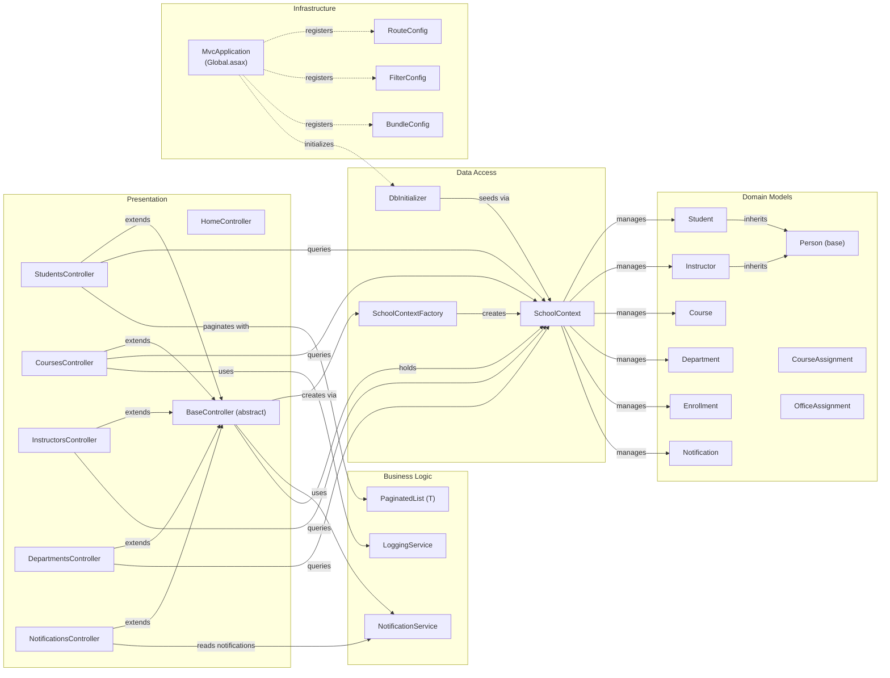

# Architecture Diagram

Contoso University is an ASP.NET MVC 5 web application targeting .NET Framework 4.8 that manages university data including students, instructors, courses, and departments, using Entity Framework Core for data access and MSMQ for asynchronous notifications.

## Application Architecture

```mermaid
flowchart TD
    subgraph Client["Client Layer"]
        Browser["Web Browser\n(jQuery 3.4.1 + Bootstrap)"]
    end

    subgraph App["Application Layer - ASP.NET MVC 5.2.9 / .NET Framework 4.8"]
        Controllers["MVC Controllers\n(Students, Courses, Instructors,\nDepartments, Notifications, Home)"]
        Views["Razor Views\n(.cshtml templates)"]
        AppStart["App_Start\n(Routes, Filters, Bundles)"]
        NotifSvc["NotificationService\n(MSMQ producer/consumer)"]
        LogSvc["LoggingService"]
    end

    subgraph Data["Data Layer - EF Core 3.1.32"]
        SchoolCtx["SchoolContext\n(DbContext)"]
        DbInit["DbInitializer\n(seed data)"]
        CtxFactory["SchoolContextFactory"]
    end

    subgraph Storage["Data Storage"]
        SqlDb[("SQL Server\nLocalDB\nContosoUniversityNoAuthEFCore")]
        FileSystem[("File System\nUploads/TeachingMaterials")]
    end

    subgraph Messaging["Messaging Infrastructure"]
        MSMQ[("MSMQ\nPrivate Queue")]
    end

    Browser -->|"HTTP requests"| Controllers
    Controllers -->|"renders"| Views
    Views -->|"HTML responses"| Browser
    AppStart -.->|"configures"| Controllers
    Controllers -->|"uses"| NotifSvc
    Controllers -->|"direct queries"| SchoolCtx
    Controllers -->|"file uploads"| FileSystem
    CtxFactory -->|"creates"| SchoolCtx
    SchoolCtx -->|"SQL queries"| SqlDb
    DbInit -->|"seeds"| SchoolCtx
    NotifSvc -->|"sends/receives"| MSMQ
    Controllers -->|"uses"| LogSvc
```

### Technology Stack Summary

| Layer | Technology | Version | Purpose |
|---|---|---|---|
| Presentation | ASP.NET MVC | 5.2.9 | Server-side web framework with controller/view pattern |
| Presentation | Razor View Engine | 3.0 | Server-side HTML templating |
| Presentation | Bootstrap | (bundled) | Responsive UI styling |
| Presentation | jQuery | 3.4.1 | Client-side interactivity and form validation |
| Business Logic | ASP.NET MVC Filters | 5.2.9 | Global error handling and request filters |
| Business Logic | Newtonsoft.Json | 13.0.3 | JSON serialization for notification messages |
| Data Access | Entity Framework Core | 3.1.32 | ORM for SQL Server data access |
| Data Access | Microsoft.Data.SqlClient | 2.1.4 | SQL Server connectivity |
| Messaging | System.Messaging (MSMQ) | .NET 4.8 built-in | Asynchronous notification queue |
| Runtime | .NET Framework | 4.8 | Application runtime platform |
| Hosting | IIS / IIS Express | - | Web server hosting |

### Data Storage & External Services

The application uses **SQL Server LocalDB** (`ContosoUniversityNoAuthEFCore`) as its primary relational store, accessed via Entity Framework Core 3.1 with a `SchoolContext` (DbContext). The schema uses Table-per-Hierarchy (TPH) inheritance for the `Person` table to store both `Student` and `Instructor` records. A local **MSMQ private queue** (`.\Private$\ContosoUniversityNotifications`) is used for asynchronous notification messaging — the `NotificationService` produces and consumes JSON-serialized notification messages from this queue. The **local file system** (`Uploads/TeachingMaterials/`) stores uploaded teaching material files.

### Key Architectural Decisions

- **Direct DbContext access from Controllers**: Controllers inherit from `BaseController` which creates a `SchoolContext` via `SchoolContextFactory` — there is no repository/service layer between controllers and EF Core, following a thin-controller pattern typical of classic ASP.NET MVC tutorials.
- **MSMQ for decoupled notifications**: Entity CRUD operations (create/update/delete) publish JSON messages to a local MSMQ private queue via `NotificationService`, decoupling audit/notification concerns from the main request pipeline.
- **Table-per-Hierarchy (TPH) inheritance**: `Student` and `Instructor` both extend `Person` and are stored in a single `Person` table with a `Discriminator` column, managed by EF Core's fluent API configuration.

## Component Relationships

### Component Inventory

| Component | Layer | Type | Responsibility |
|---|---|---|---|
| BaseController | Presentation | Abstract MVC Controller | Shared base providing `SchoolContext`, `NotificationService`, and `SendEntityNotification` helper to all controllers |
| HomeController | Presentation | MVC Controller | Renders home, about, and contact pages; shows enrollment statistics |
| StudentsController | Presentation | MVC Controller | Full CRUD for student records with search, sort, and pagination |
| CoursesController | Presentation | MVC Controller | Full CRUD for courses including department assignment |
| InstructorsController | Presentation | MVC Controller | Full CRUD for instructors with office and course assignments |
| DepartmentsController | Presentation | MVC Controller | Full CRUD for departments with instructor administrator assignment |
| NotificationsController | Presentation | MVC Controller | Displays and manages notification messages from the MSMQ queue |
| NotificationService | Business Logic | Service | Produces and consumes JSON-serialized entity event messages via MSMQ |
| LoggingService | Business Logic | Service | Application-level logging support |
| PaginatedList | Business Logic | Generic Utility | Provides IQueryable-based pagination for list views |
| SchoolContext | Data Access | EF Core DbContext | Defines all DbSets, configures TPH inheritance, and manages database access |
| SchoolContextFactory | Data Access | Static Factory | Creates configured `SchoolContext` instances from `Web.config` connection string |
| DbInitializer | Data Access | Initializer | Seeds the database with initial test data on first run |
| Person | Domain | Entity (base) | Abstract base class for Student and Instructor (TPH) |
| Student | Domain | Entity | Student data with enrollment date; inherits Person |
| Instructor | Domain | Entity | Instructor data with hire date; inherits Person |
| Course | Domain | Entity | Course data with credits and department reference |
| Department | Domain | Entity | Department with budget, start date, and administrator instructor |
| Enrollment | Domain | Entity | Join entity linking Student to Course with a grade |
| CourseAssignment | Domain | Entity | Many-to-many join between Instructor and Course |
| OfficeAssignment | Domain | Entity | One-to-one office location for Instructor |
| Notification | Domain | Entity | Stores entity operation events (create/update/delete) for queue and DB persistence |
| RouteConfig | Infrastructure | App_Start Config | Registers conventional MVC routes |
| FilterConfig | Infrastructure | App_Start Config | Registers global MVC action filters (HandleErrorAttribute) |
| BundleConfig | Infrastructure | App_Start Config | Configures CSS/JS bundles for optimization |
| MvcApplication | Infrastructure | HttpApplication | Application entry point; initializes routes, filters, bundles, and seeds DB on startup |
