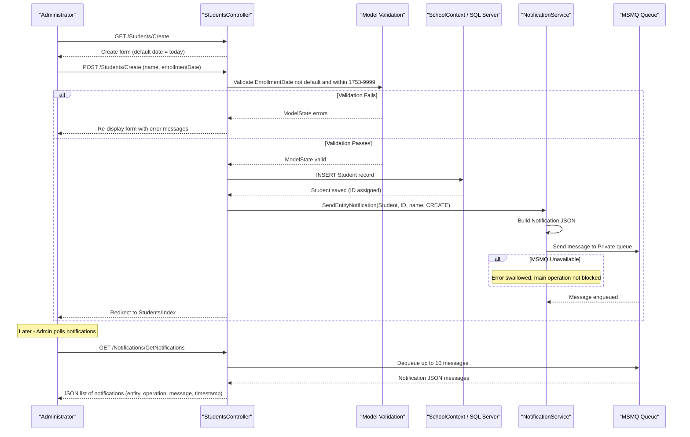

# Core Business Workflows

Contoso University is an academic management web application that enables administrators and staff to manage students, instructors, courses, departments, and course enrollments, with real-time change notifications delivered via an internal message queue.

## Domain Entities

| Entity | Service / Bounded Context | Description | Key Relationships |
|---|---|---|---|
| Student | Academic Records | A person enrolled in the university, identified by name and enrollment date | Has many Enrollments; inherits from Person |
| Instructor | Faculty Management | A teaching staff member with a hire date and optional office location | Has many CourseAssignments; may have one OfficeAssignment; may administer one Department |
| Person | Identity | Abstract base providing shared identity (ID, first/last name) for students and instructors | Base type for Student and Instructor |
| Department | Organizational Structure | An academic department with a budget and an optional designated administrator (Instructor) | Has one administrator (Instructor); owns many Courses |
| Course | Curriculum Management | An academic course with a credit value, optional teaching material image, and owning department | Belongs to one Department; has many Enrollments; has many CourseAssignments |
| Enrollment | Student-Course Relationship | The record of a student being enrolled in a specific course, optionally with a grade (A–F) | Links one Student to one Course |
| CourseAssignment | Instructor-Course Relationship | The assignment of an instructor to teach a specific course | Links one Instructor to one Course |
| OfficeAssignment | Faculty Management | The physical office location optionally assigned to an instructor | One-to-one with Instructor |
| Notification | Change Tracking | An event record generated whenever a Student, Instructor, Course, or Department is created, updated, or deleted | Standalone; references EntityType and EntityId |

## Service-to-Domain Mapping

This is a single-tier monolithic ASP.NET MVC application. All domain logic resides within one deployable unit. There are no inter-service boundaries; instead, bounded contexts are separated by controller and model layer conventions.

| Component | Domain Context | Owned Entities | External Dependencies |
|---|---|---|---|
| StudentsController | Academic Records | Student, Enrollment | SchoolContext (database), NotificationService (MSMQ) |
| InstructorsController | Faculty Management | Instructor, OfficeAssignment, CourseAssignment | SchoolContext (database), NotificationService (MSMQ) |
| CoursesController | Curriculum Management | Course | SchoolContext (database), NotificationService (MSMQ), File System (teaching material images) |
| DepartmentsController | Organizational Structure | Department | SchoolContext (database), NotificationService (MSMQ) |
| HomeController | Reporting / Statistics | Student (read-only aggregation) | SchoolContext (database) |
| NotificationsController | Change Tracking | Notification | NotificationService (MSMQ) |
| NotificationService | Change Tracking | Notification | MSMQ (`.\Private$\ContosoUniversityNotifications`) |
| SchoolContext | Persistence | All domain entities | SQL Server (via Entity Framework Core) |

## Primary Workflows

### Workflow 1: Student Registration

An administrator registers a new student in the university system.

1. Admin opens the student creation form (`GET /Students/Create`). The form pre-populates today's date as the enrollment date.
2. Admin submits the form with last name, first name, and enrollment date (`POST /Students/Create`).
3. The controller validates that the enrollment date is not the default minimum value and falls within the SQL Server datetime range (1753–9999).
4. If model state is valid, the student record is persisted to the database.
5. A `CREATE` notification is serialized to JSON and sent to the MSMQ queue with the student's display name.
6. Admin is redirected to the student list. The new student appears in alphabetical order by last name (default sort).

### Workflow 2: Student Enrollment in a Course (Grade Assignment)

Enrollment records are managed indirectly via the Student details view and course associations stored in the Enrollment table. A student's course list and grades (A–F, or "No grade") are visible on the student detail page, populated via eager-loaded Enrollments and their associated Courses.

### Workflow 3: Instructor Management with Course Assignments

An administrator creates or updates an instructor, optionally assigning courses and an office location.

1. Admin opens the instructor creation form (`GET /Instructors/Create`). The system loads all available courses and marks none as assigned.
2. Admin fills in last name, first name, hire date, optional office location, and selects one or more courses.
3. On submit (`POST /Instructors/Create`), the controller builds CourseAssignment records for each selected course.
4. If model state is valid, the instructor (with CourseAssignments) is persisted.
5. A `CREATE` notification is sent to the MSMQ queue.

For **editing**, the controller loads the full instructor graph (OfficeAssignment, CourseAssignments with Courses), then calls `UpdateInstructorCourses` to diff the previously assigned courses against the new selection—adding new CourseAssignment records and marking removed ones as `Deleted`. If the office location is blank, the OfficeAssignment is nulled out (removed).

### Workflow 4: Course Creation with Teaching Material Upload

An administrator creates a new course and optionally attaches a teaching material image.

1. Admin opens the course creation form (`GET /Courses/Create`). A department dropdown is populated.
2. Admin provides a course number, title, credits (0–5), department, and optionally uploads an image file.
3. On submit (`POST /Courses/Create`), if an image is included:
   - File extension is validated against the allowlist: `.jpg`, `.jpeg`, `.png`, `.gif`, `.bmp`.
   - File size is validated: must be ≤ 5 MB.
   - The uploads directory (`~/Uploads/TeachingMaterials/`) is created if absent.
   - A unique filename is generated using the course ID and a GUID.
   - The file is saved to disk; the relative path is stored on the Course entity.
4. The course record is persisted, and a `CREATE` notification is sent to the MSMQ queue.

On **deletion**, the associated image file is deleted from disk (errors are swallowed to prevent blocking course deletion), and a `DELETE` notification is sent.

### Workflow 5: Department Management with Concurrency Control

An administrator manages academic departments and assigns an instructor as administrator.

1. Admin creates or edits a department with name, budget, start date, and an optional administrator (chosen from the instructor list).
2. On edit submit, the controller uses Entity Framework's `RowVersion` (timestamp) to detect concurrent modifications.
3. If a `DbUpdateConcurrencyException` is raised, the conflict details are shown field-by-field (name, budget, start date, administrator), and the user is prompted to resubmit or navigate away.
4. On successful save, an `UPDATE` notification is sent to the MSMQ queue.
5. When an instructor is deleted, any Department that has that instructor as its administrator has its `InstructorID` set to `null` to preserve referential integrity.

### Workflow 6: Enrollment Statistics Dashboard

The Home/About page aggregates student enrollment counts grouped by enrollment date.

1. A LINQ group-by query groups all students by `EnrollmentDate` and counts each group.
2. The result is displayed as a summary table for administrative reporting.

### Workflow 7: Notification Polling and Review

Administrators can review a running log of create/update/delete events across all entities.

1. The Notifications dashboard page (`GET /Notifications/Index`) renders the notification viewer UI.
2. The browser polls `GET /Notifications/GetNotifications`, which dequeues up to 10 messages from the MSMQ queue and returns them as JSON.
3. Each notification record includes entity type, entity ID, operation type, human-readable message, timestamp, and a read flag.
4. Administrators can mark individual notifications as read (`POST /Notifications/MarkAsRead`).

## Cross-Service Data Flows

This application is a monolith with no inter-service network calls. All data flows occur within a single process:

- **Controller → SchoolContext → SQL Server**: All CRUD operations go through Entity Framework Core. The `SchoolContextFactory.Create()` method instantiates the context per request.
- **Controller → NotificationService → MSMQ**: After every successful Create, Update, or Delete, the controller calls `SendEntityNotification`, which serializes a `Notification` object to JSON and sends it to the local MSMQ queue `.\Private$\ContosoUniversityNotifications`. The queue is created automatically if it does not exist, with full-control permissions granted to `Everyone`.
- **NotificationsController → MSMQ → Browser**: The polling endpoint dequeues available messages (up to 10 per poll) and returns them as JSON to the client. Messages are consumed from the queue on read (destructive read); no durable notification store is maintained beyond the queue.
- **Instructor deletion cascade to Departments**: The `InstructorsController.DeleteConfirmed` action manually nulls `Department.InstructorID` for any department administered by the deleted instructor before saving, enforcing a business integrity rule that is not enforced at the database constraint level.

## Business Workflow Sequence

The sequence below shows the primary end-to-end workflow: an administrator registers a new student, and the system persists the record and dispatches a change notification.

## Business Rules & Decision Logic

### Validation Rules

- **Student / Instructor dates**: Enrollment date (Student) and hire date (Instructor) must not be the default `DateTime.MinValue` and must fall within the SQL Server datetime range of 1753-01-01 to 9999-12-31. This is enforced both by model data annotations and explicit controller-level checks.
- **Person names**: Last name and first name are required, each with a maximum of 50 characters.
- **Course title**: Required; 3–50 characters.
- **Course credits**: Must be in the range 0–5.
- **Department name**: Required; 3–50 characters.
- **Teaching material image**: Must be one of `.jpg`, `.jpeg`, `.png`, `.gif`, `.bmp`; maximum size 5 MB.

### Decision Logic

- **Instructor office assignment removal**: If the office location field is blank on edit, the OfficeAssignment record is removed (nulled). An empty string is treated as "no office assigned."
- **Course assignment diffing**: On instructor edit, the controller computes the symmetric difference between the previously assigned courses and the new selection. New assignments are added; removed assignments are marked `EntityState.Deleted`.
- **Instructor deletion impact on departments**: Before removing an instructor, the system checks for any department listing that instructor as its administrator and clears the reference to prevent orphaned foreign keys.
- **Teaching material file on course deletion**: The associated image file is deleted from disk when a course is deleted. File deletion errors are caught and logged but do not block the course deletion.
- **Notification failure isolation**: `SendEntityNotification` is wrapped in a try/catch in both the BaseController and NotificationService. A failure to enqueue a notification never rolls back or blocks the originating database operation.

### State Transitions

- **Enrollment grade lifecycle**: A student's enrollment record may have no grade (`null`, displayed as "No grade") or a letter grade (A, B, C, D, F). Grades can be set or updated as course results are recorded.
- **Department administrator**: A department may have no administrator (`InstructorID` is nullable). If the assigned instructor is deleted, the department reverts to having no administrator.

### Concurrency Control

- **Department optimistic concurrency**: The `Department` entity carries a `RowVersion` (byte-array timestamp) column. On edit, EF detects concurrent modifications via `DbUpdateConcurrencyException`. The controller resolves conflicts by retrieving the current database values and surfacing field-level differences to the user, requiring them to resubmit with awareness of the conflict.

### Cross-Cutting Concerns

- **Transactions**: All persistence calls use a single `db.SaveChanges()` per action, with implicit EF transaction scope. There are no explicit distributed transactions.
- **Error handling**: Controllers use try/catch blocks; model errors are added to `ModelState` to surface them in the UI. Unrecoverable errors redirect to an error page.
- **Audit / notifications**: Every create, update, and delete operation across Students, Instructors, Courses, and Departments publishes an event to the MSMQ notification queue with entity type, entity ID, display name, operation, timestamp, and originating user (defaulting to "System" as there is no authentication).
- **Authorization**: No authentication or role-based authorization is currently implemented. Comment references to "Admins," "Teachers," and "All roles" exist in the code but are not enforced.
- **Pagination**: The student list supports server-side pagination (default page size: 10) and combined search-and-sort by last name or enrollment date.
- **File storage**: Teaching material images are stored on the local file system under `~/Uploads/TeachingMaterials/`. There is no CDN or cloud storage integration.
