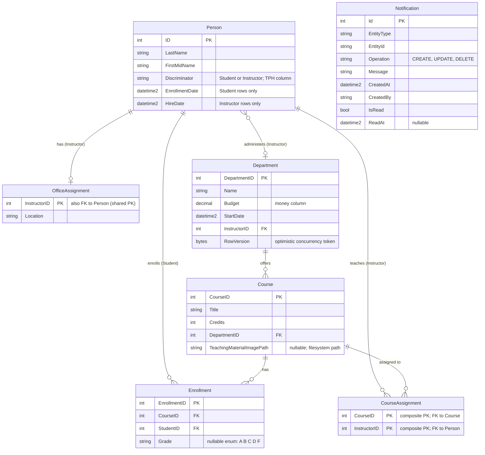

# Data Architecture & Persistence Layer

This application uses a single SQL Server database with Entity Framework Core 3.1 as the ORM, exposing 8 entity types (7 domain + 1 audit) via a shared `SchoolContext` DbContext with Table-per-Hierarchy (TPH) inheritance for the `Person` hierarchy.

## Database Configuration

| Service/Module | DB Type | Profile | Driver | Connection | Migration Tool |
|---|---|---|---|---|---|
| ContosoUniversity (all) | SQL Server (LocalDB) | Default (single profile) | `Microsoft.Data.SqlClient` 2.1.4 via `Microsoft.EntityFrameworkCore.SqlServer` 3.1.32 | `(LocalDb)\MSSQLLocalDB`, catalog `ContosoUniversityNoAuthEFCore`, Integrated Security, MARS enabled | None — schema is created via `EnsureCreated()` at startup; SQL scripts are not authoritative. See `configuration-inventory.md` for full property inventory. |

**Schema management behaviour:** EF Core's `EnsureCreated()` creates the database and all tables on first run if they do not exist. No Flyway, Liquibase, or EF Core Migrations are used; schema changes require manual intervention or a full database drop-and-recreate.

**Seed data:** `DbInitializer.Initialize()` (`Data/DbInitializer.cs`) programmatically inserts Students, Instructors, Departments, Courses, OfficeAssignments, CourseAssignments, and Enrollments on first run (guards against re-seeding via `context.Students.Any()` check).

## Data Ownership per Service

| Service | Tables Owned | ORM Framework | Caching | Notes |
|---|---|---|---|---|
| ContosoUniversity (monolith) | Person, Course, Enrollment, Department, OfficeAssignment, CourseAssignment, Notification | EF Core 3.1.32 (`SchoolContext`) | None (no cache provider configured despite `Microsoft.Extensions.Caching.Memory` package being present) | Single bounded context; all controllers share one `SchoolContext` instance instantiated per request via `SchoolContextFactory.Create()` |

## Entity Model

**TPH Inheritance:** `Student` and `Instructor` both map to the `Person` table with a `Discriminator` string column (`"Student"` / `"Instructor"`). EF Core exposes separate `DbSet<Student>` and `DbSet<Instructor>` views filtered automatically by the discriminator.

**Relationships summary:**
- `Department` → `Course`: one-to-many (a department offers many courses)
- `Course` ↔ `Instructor` via `CourseAssignment`: many-to-many join table with composite PK
- `Instructor` → `OfficeAssignment`: one-to-zero-or-one (shared PK pattern)
- `Course` → `Enrollment`: one-to-many; `Student` → `Enrollment`: one-to-many (Student enrols in many courses)
- `Department` → `Instructor` (Administrator): many-to-zero-or-one (nullable FK on Department)

**Concurrency:** `Department.RowVersion` (`[Timestamp]`) enables optimistic concurrency; `DbUpdateConcurrencyException` is handled in `DepartmentsController`.

## Key Repository Methods

> This application does not use the Repository pattern. Controllers inherit `BaseController` and access `SchoolContext` (`db`) directly. The table below documents the significant custom query patterns found in each controller.

| Controller | Entity | Notable Query Patterns | Purpose |
|---|---|---|---|
| `StudentsController` | `Student` | `db.Students.Where(s => s.LastName.Contains(...) \|\| s.FirstMidName.Contains(...))` with `OrderBy`/`OrderByDescending` | Server-side search and sort for paginated student listing |
| `StudentsController` | `Student` | `db.Students.Include(s => s.Enrollments).ThenInclude(e => e.Course).Where(s => s.ID == id)` | Eager-load enrollments and courses for student details view |
| `InstructorsController` | `Instructor` | `db.Instructors.Include(i => i.OfficeAssignment).Include(i => i.CourseAssignments).ThenInclude(c => c.Course).ThenInclude(d => d.Department).OrderBy(i => i.LastName)` | Deeply nested eager load for full instructor index (office, courses, departments) |
| `InstructorsController` | `Instructor` | `db.Instructors.Include(i => i.OfficeAssignment).Include(i => i.CourseAssignments).ThenInclude(c => c.Course).Where(i => i.ID == id)` | Eager-load instructor graph for edit |
| `DepartmentsController` | `Department` | `db.Departments.Include(d => d.Administrator)` | Eager-load administrator (Instructor) for department listing |
| `DepartmentsController` | `Department` | `db.Departments.Where(d => d.InstructorID == id)` | Find departments administered by an instructor before deletion |
| `CoursesController` | `Course` | `db.Courses.Include(c => c.Department).Where(c => c.CourseID == id)` | Eager-load department for course details/delete views |
| `NotificationsController` | `Notification` | Standard CRUD via `db.Notifications` | Persist and display audit notifications |

**Transaction management:** Implicit — each `SaveChanges()` call is a single unit of work. No explicit `TransactionScope` or `BeginTransaction()` is used.

## Caching Strategy

No caching layer is configured or used in this application.

| Aspect | Detail |
|---|---|
| Cache provider | None configured |
| Package present | `Microsoft.Extensions.Caching.Memory` 3.1.32 is referenced in `packages.config` but no `IMemoryCache` injection or `[ResponseCache]` attributes appear in any controller or service |
| Query result caching | Not implemented |
| Session caching | Not implemented |
| Second-level cache | Not applicable (EF Core second-level cache not enabled) |

**Rationale gap:** Reference data that changes rarely — such as `Department` names and `Course` listings — would be natural candidates for in-memory caching, but no caching has been wired up.

## Data Ownership Boundaries

**Shared data store — single database, single context:** All entities are owned by a single monolithic application with one `SchoolContext`. There is no database-per-service separation, no schema-per-module isolation, and no logical namespace partitioning beyond the table names themselves.

**Cross-service data access:** Not applicable — the application is a monolith. All data access flows through `SchoolContext` shared by all controllers via `BaseController`.

**Read/write patterns:**
- All controllers perform read and write operations against the same context.
- No CQRS pattern; no read model / write model separation.
- `StudentsController` performs server-side filtering and sorting at the database level via LINQ-to-SQL.
- `InstructorsController` performs multi-level eager loading in a single query, aggregating `Instructor → CourseAssignment → Course → Department` in one round-trip.

**Notification persistence split:** The `Notification` entity has a DB table (`Notification` via `SchoolContext`) but `NotificationService` writes notification events to an MSMQ queue rather than directly to this table. The `NotificationsController` reads from the database table, suggesting an intended but currently incomplete pattern where a background consumer would persist MSMQ messages to the `Notification` table; as coded, the queue and the table are not connected.

### Data Classification & Sensitivity

| Entity | Sensitive Fields | Classification | Controls in Place |
|---|---|---|---|
| `Person` (Student / Instructor) | `LastName`, `FirstMidName` | PII (personal names) | None — no encryption-at-rest, no field-level masking, no column-level security |
| `Department` | None | None | — |
| `Course` | None | None | — |
| `Enrollment` | `StudentID` (links a person to a course and grade) | PII (indirectly — reveals academic record) | None |
| `Notification` | `CreatedBy` (stores actor identity; currently hardcoded to `"System"`) | Low — no real user identity stored | None |
| `OfficeAssignment` | None | None | — |
| `CourseAssignment` | None | None | — |

**Summary:** `Person` stores first and last names (PII). `Enrollment` indirectly stores academic performance records linked to individuals (potential PII/FERPA-regulated data in educational contexts). No encryption-at-rest, data masking, field-level access controls, or audit logging for data access are configured. No PHI or PCI data detected.
