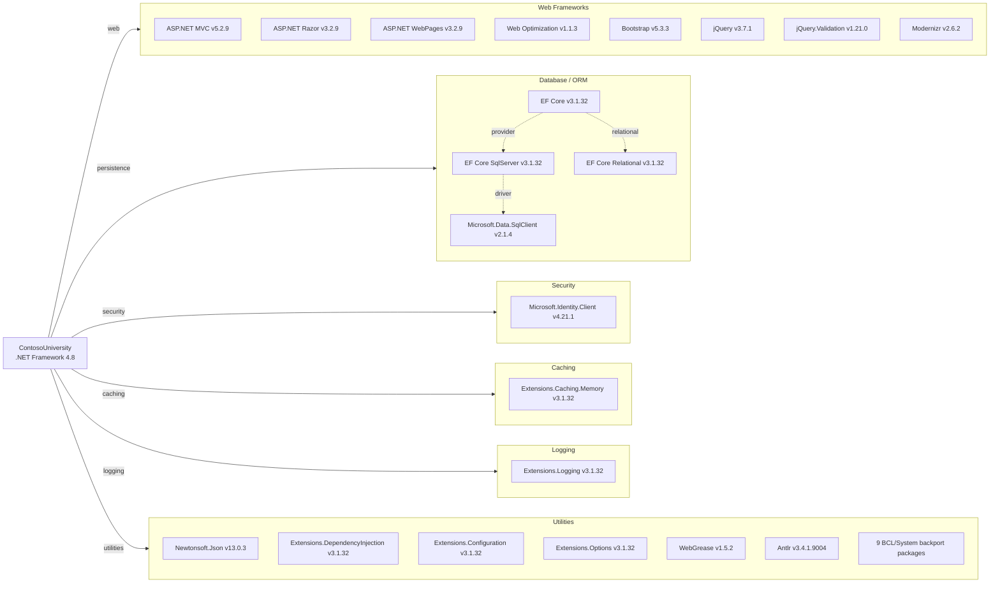

# Dependency Map

ContosoUniversity is an ASP.NET MVC 5 web application targeting .NET Framework 4.8, with 47 declared NuGet packages spanning web, data access, security, caching, logging, and utility concerns.

## Dependencies

### Dependency Summary

| Category | Count | Key Libraries | Notes |
|----------|-------|---------------|-------|
| Web Frameworks | 8 | ASP.NET MVC 5.2.9, Razor 3.2.9, Bootstrap 5.3.3, jQuery 3.7.1 | Legacy MVC stack on .NET Framework; Modernizr is deprecated |
| Database / ORM | 7 | EF Core 3.1.32, EF Core SqlServer 3.1.32, SqlClient 2.1.4 | EF Core 3.1 is end-of-life; mixed EF Core on .NET Framework is unusual |
| Security | 1 | Microsoft.Identity.Client 4.21.1 | MSAL library present but no OAuth middleware configured |
| Caching | 2 | Extensions.Caching.Memory 3.1.32 | In-memory only; no distributed cache |
| Logging | 2 | Extensions.Logging 3.1.32 | Abstractions layer only; no concrete provider configured |
| Utilities | 15 | Newtonsoft.Json 13.0.3, Extensions.DI 3.1.32, Extensions.Configuration 3.1.32 | Many BCL backport packages for .NET Framework compatibility |

### Version & Compatibility Risks

The project targets .NET Framework 4.8, which is in long-term maintenance mode with no new feature development. **EF Core 3.1.32** reached end-of-life in December 2022 and is running on .NET Framework via `netstandard2.0` binaries — an unsupported configuration that Microsoft does not recommend for production use. **ASP.NET MVC 5.2.9** is a legacy framework with no migration path other than rewriting to ASP.NET Core MVC. **Microsoft.Data.SqlClient 2.1.4** is several major versions behind the current release (5.x), and older versions have had security patches. **Microsoft.Identity.Client 4.21.1** is far behind the current 4.x series (4.61+) and may be missing important security fixes. **Modernizr 2.6.2** is an abandoned project. The `Microsoft.Extensions.*` packages at version 3.1.32 are .NET Core 3.1 era packages also past end-of-life.

### Notable Observations

- **EF Core on .NET Framework**: Using EF Core 3.1 on .NET Framework 4.8 is a non-standard configuration. Microsoft's ORM for .NET Framework is Entity Framework 6 (EF6), not EF Core; this creates compatibility risks and limits upgrade options.
- **Duplicate logging abstractions without a provider**: `Microsoft.Extensions.Logging` and its abstractions are present, but no concrete logging provider (e.g., Serilog, NLog, Application Insights) is declared — log output may silently be dropped.
- **Bootstrap 5.3.3 with legacy server stack**: Bootstrap 5 is a modern frontend library but is paired with a legacy ASP.NET MVC 5 / .NET Framework 4.8 backend, indicating the frontend has been updated independently of the server stack.
- **No distributed caching or messaging**: Only in-process `MemoryCache` is used; no Redis, Azure Cache, or messaging infrastructure is present, which may limit horizontal scalability.

## Test Dependencies

No test-scoped dependencies were detected in `packages.config` or the project file.

| Framework | Version | Notes |
|-----------|---------|-------|
| *(none detected)* | — | No unit or integration test packages declared |

Total test-scope dependencies: 0

No test frameworks (xUnit, NUnit, MSTest) or mocking libraries (Moq, NSubstitute) are declared in the build files. This is a significant gap — there are no automated tests to validate behavior during a modernization migration.
