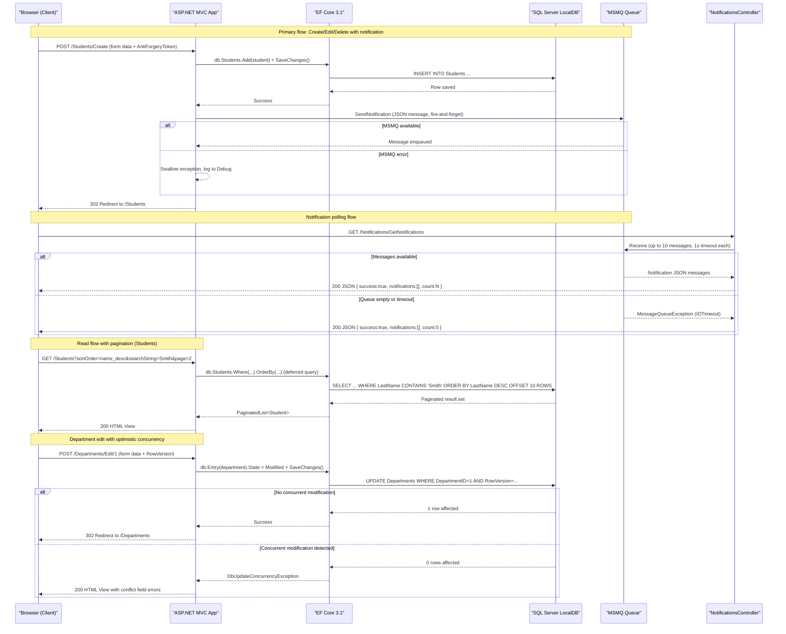

# API & Service Communication Contracts

This is a single-deployable ASP.NET MVC 5 web application exposing 26 server-rendered HTML endpoints plus 2 JSON API endpoints for in-process notification polling; all communication is synchronous HTTP with no inter-service calls or external API dependencies.

## Service Catalog

| Service | Port | Category | Purpose |
|---------|------|----------|---------|
| ContosoUniversity (Web App) | 44300 (HTTPS / IIS Express), 58801 (HTTP / Dev Server) | Business | Monolithic ASP.NET MVC 5 web application providing university management for students, courses, instructors, and departments |
| MSMQ Notification Queue | N/A (in-process) | Infrastructure | Private MSMQ queue (`.\Private$\ContosoUniversityNotifications`) for fire-and-forget entity change notifications within the same host |
| SQL Server LocalDB | N/A (in-process) | Infrastructure | Relational data store accessed via Entity Framework Core 3.1 |

## API Endpoints Inventory

### HomeController — `/Home`

| Method | Path | Request Type | Response Type | Notes |
|--------|------|--------------|---------------|-------|
| GET | `/` or `/Home/Index` | — | HTML View | Landing page |
| GET | `/Home/About` | — | HTML View (`List<EnrollmentDateGroup>`) | Enrollment statistics by date |
| GET | `/Home/Contact` | — | HTML View | Contact page |
| GET | `/Home/Error` | — | HTML View | Generic error page |
| GET | `/Home/Unauthorized` | — | HTML View | 403-equivalent page |

### StudentsController — `/Students`

| Method | Path | Request Type | Response Type | Notes |
|--------|------|--------------|---------------|-------|
| GET | `/Students` | Query: `sortOrder`, `currentFilter`, `searchString`, `page` (int) | HTML View (`PaginatedList<Student>`) | Paginated, sortable, filterable list |
| GET | `/Students/Details/{id}` | Path: `id` (int) | HTML View (`Student` + Enrollments + Courses) | Returns 400 if id null, 404 if not found |
| GET | `/Students/Create` | — | HTML View (`Student`) | Pre-fills EnrollmentDate to today |
| POST | `/Students/Create` | Form Body: `LastName`, `FirstMidName`, `EnrollmentDate` | Redirect / HTML View | AntiForgery token required; returns 400 if date invalid |
| GET | `/Students/Edit/{id}` | Path: `id` (int) | HTML View (`Student`) | Returns 400/404 on bad id |
| POST | `/Students/Edit/{id}` | Form Body: `ID`, `LastName`, `FirstMidName`, `EnrollmentDate` | Redirect / HTML View | AntiForgery token required |
| GET | `/Students/Delete/{id}` | Path: `id` (int) | HTML View (`Student`) | Confirmation page |
| POST | `/Students/Delete/{id}` | Path: `id` (int) | Redirect | AntiForgery token required |

### CoursesController — `/Courses`

| Method | Path | Request Type | Response Type | Notes |
|--------|------|--------------|---------------|-------|
| GET | `/Courses` | — | HTML View (`List<Course>` with Department) | |
| GET | `/Courses/Details/{id}` | Path: `id` (int) | HTML View (`Course` with Department) | Returns 400/404 on bad id |
| GET | `/Courses/Create` | — | HTML View (`Course`) | Populates Department dropdown |
| POST | `/Courses/Create` | Form Body: `CourseID`, `Title`, `Credits`, `DepartmentID`; File: `teachingMaterialImage` | Redirect / HTML View | Image upload: max 5 MB, extensions jpg/jpeg/png/gif/bmp |
| GET | `/Courses/Edit/{id}` | Path: `id` (int) | HTML View (`Course`) | Returns 400/404 on bad id |
| POST | `/Courses/Edit/{id}` | Form Body: `CourseID`, `Title`, `Credits`, `DepartmentID`, `TeachingMaterialImagePath`; File: `teachingMaterialImage` | Redirect / HTML View | Replaces existing image file on disk |
| GET | `/Courses/Delete/{id}` | Path: `id` (int) | HTML View (`Course`) | Confirmation page |
| POST | `/Courses/Delete/{id}` | Path: `id` (int) | Redirect | Deletes associated image file from disk |

### InstructorsController — `/Instructors`

| Method | Path | Request Type | Response Type | Notes |
|--------|------|--------------|---------------|-------|
| GET | `/Instructors` | Query: `id` (int?), `courseID` (int?) | HTML View (`InstructorIndexData`) | Optional drill-down into courses/enrollments |
| GET | `/Instructors/Details/{id}` | Path: `id` (int) | HTML View (`Instructor`) | Returns 400/404 on bad id |
| GET | `/Instructors/Create` | — | HTML View (`Instructor`) | Populates assigned-course checkboxes |
| POST | `/Instructors/Create` | Form Body: `LastName`, `FirstMidName`, `HireDate`, `OfficeAssignment`; Form Array: `selectedCourses[]` | Redirect / HTML View | AntiForgery token required |
| GET | `/Instructors/Edit/{id}` | Path: `id` (int) | HTML View (`Instructor`) | Returns 400/404 on bad id |
| POST | `/Instructors/Edit/{id}` | Path: `id` (int?); Form Array: `selectedCourses[]` | Redirect / HTML View | AntiForgery token required |
| GET | `/Instructors/Delete/{id}` | Path: `id` (int) | HTML View (`Instructor`) | Confirmation page |
| POST | `/Instructors/Delete/{id}` | Path: `id` (int) | Redirect | Nullifies Department.InstructorID if set |

### DepartmentsController — `/Departments`

| Method | Path | Request Type | Response Type | Notes |
|--------|------|--------------|---------------|-------|
| GET | `/Departments` | — | HTML View (`List<Department>` with Administrator) | |
| GET | `/Departments/Details/{id}` | Path: `id` (int) | HTML View (`Department`) | Returns 400/404 on bad id |
| GET | `/Departments/Create` | — | HTML View | Populates Instructor dropdown |
| POST | `/Departments/Create` | Form Body: `Name`, `Budget`, `StartDate`, `InstructorID` | Redirect / HTML View | AntiForgery token required |
| GET | `/Departments/Edit/{id}` | Path: `id` (int) | HTML View (`Department`) | Returns 400/404 on bad id |
| POST | `/Departments/Edit/{id}` | Form Body: `DepartmentID`, `Name`, `Budget`, `StartDate`, `InstructorID`, `RowVersion` | Redirect / HTML View | Optimistic concurrency via `RowVersion`; returns conflict details on `DbUpdateConcurrencyException` |
| GET | `/Departments/Delete/{id}` | Path: `id` (int) | HTML View (`Department`) | Confirmation page |
| POST | `/Departments/Delete/{id}` | Path: `id` (int) | Redirect | AntiForgery token required |

### NotificationsController — `/Notifications`

| Method | Path | Request Type | Response Type | Notes |
|--------|------|--------------|---------------|-------|
| GET | `/Notifications` | — | HTML View | Admin notification dashboard |
| GET | `/Notifications/GetNotifications` | — | JSON `{ success, notifications[], count }` | Reads up to 10 messages from MSMQ queue |
| POST | `/Notifications/MarkAsRead` | Form: `id` (int) | JSON `{ success }` | Currently a no-op stub |

## Management & Observability Endpoints

| Service | Endpoint | Notes |
|---------|----------|-------|
| ContosoUniversity | `/Home/Error` | Custom error page (not a health probe) |
| ContosoUniversity | `/Home/Unauthorized` | Custom authorization-denied page |

> No health check probes, Swagger/OpenAPI UI, or metrics export endpoints are configured. No Spring Actuator or .NET health-check middleware is present.

## DTOs & Contracts

This is a single-service application; there are no gateway-level aggregation DTOs. All models are service-level domain objects used directly in MVC views.

**Domain / View Models:**

| Class | API Role | Immutability |
|-------|----------|-------------|
| `Student` | Request body (Create/Edit forms), View response | Mutable POCO |
| `Course` | Request body (Create/Edit forms), View response | Mutable POCO |
| `Instructor` | Request body (Create/Edit forms), View response | Mutable POCO |
| `Department` | Request body (Create/Edit forms), View response | Mutable POCO; includes `RowVersion` (byte[]) for optimistic concurrency |
| `Enrollment` | Nested response within Student/Instructor views | Mutable POCO |
| `Notification` | JSON response body (`GetNotifications`) | Mutable POCO |
| `InstructorIndexData` | Composite view model combining Instructors + Courses + Enrollments for the Instructors Index view | Mutable POCO |
| `AssignedCourseData` | Checkbox projection for course assignment in Instructor Create/Edit views | Mutable POCO |
| `EnrollmentDateGroup` | Aggregated response for Home/About enrollment statistics | Mutable POCO |
| `ErrorViewModel` | Error view response | Mutable POCO |
| `PaginatedList<T>` | Generic wrapper adding pagination metadata (`PageIndex`, `TotalPages`, `HasPreviousPage`, `HasNextPage`) around any IQueryable result | Mutable generic class |

**Serialization:** Newtonsoft.Json 13.0.3 is used for MSMQ message serialization (`Notification` objects) and for JSON responses from `NotificationsController`. No custom serializers or Jackson-equivalent configuration is present. No OpenAPI/Swagger spec, protobuf schemas, or GraphQL schemas exist.

**Form binding:** ASP.NET MVC `[Bind(Include = "...")]` white-listing is used on all POST actions to restrict bound fields.

## Communication Patterns

### Synchronous (HTTP / In-Process)

All client-to-application communication is synchronous HTTP handled by the ASP.NET MVC pipeline. There is a single deployable unit; no inter-service REST, gRPC, or service-to-service HTTP calls exist. Controllers call `SchoolContext` (EF Core 3.1 over SQL Server) directly via synchronous LINQ queries.

**File upload:** `CoursesController` accepts `multipart/form-data` via `HttpPostedFileBase` (max 10 MB configured in `Web.config` `httpRuntime`/`requestLimits`; application-level validation restricts image uploads to 5 MB). Files are written to `~/Uploads/TeachingMaterials/` on the web server's local filesystem.

### Asynchronous (MSMQ)

After every successful Create, Update, or Delete operation on Students, Courses, Instructors, and Departments, `BaseController.SendEntityNotification()` enqueues a `Notification` JSON message to the local MSMQ private queue `.\Private$\ContosoUniversityNotifications`. This is fire-and-forget: failures are caught, logged to `Debug.WriteLine`, and silently swallowed without affecting the main operation. The `NotificationsController.GetNotifications()` action dequeues up to 10 messages on each poll. `MarkAsRead` is a stub with no persistence.

### Resilience Policies

No circuit breaker, retry, timeout, or bulkhead patterns are implemented. MSMQ `Receive` has a 1-second timeout (`TimeSpan.FromSeconds(1)`) used only to avoid blocking when the queue is empty.

### Service Discovery

Not applicable — single deployable unit with hardcoded local connection string and queue path. No Eureka, Consul, or DNS-based discovery is configured.

### API Gateway

Not applicable — no gateway layer exists.

### Security Posture

**No authentication or TLS is configured at the application level.** The `.csproj` IIS Express configuration references `https://localhost:44300/` for local development, but no authentication middleware, `[Authorize]` attributes, JWT validation, OAuth2, or role-based access control is applied to any controller or action. All 28 endpoints are publicly accessible with no authorization checks. The `BaseController` explicitly notes `// No authentication, use System as default user` when setting the notification `CreatedBy` field. Windows Authentication is configured as disabled in the IIS Express project settings (`IISExpressWindowsAuthentication` = `enabled` in `.csproj` but `IISExpressAnonymousAuthentication` = `disabled`, leaving Windows Authentication as the IIS Express default — however no `[Authorize]` or role checks are present in code).

## Service Technology Matrix

| Capability | ContosoUniversity |
|------------|------------------|
| Web Framework | ASP.NET MVC 5 (System.Web.Mvc 5.2.9), .NET Framework 4.8 |
| Data Access | Entity Framework Core 3.1 (EF Core + SQL Server provider) |
| Service Discovery | None |
| API Gateway | None |
| Health Checks | None |
| Caching | None (Microsoft.Extensions.Caching.Memory referenced but not used) |
| Metrics Export | None |
| Async Messaging | MSMQ (System.Messaging) via `NotificationService` |
| Serialization | Newtonsoft.Json 13.0.3 |

## Service Communication Sequence

