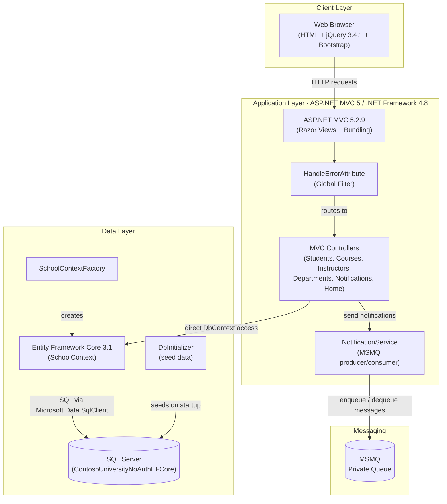
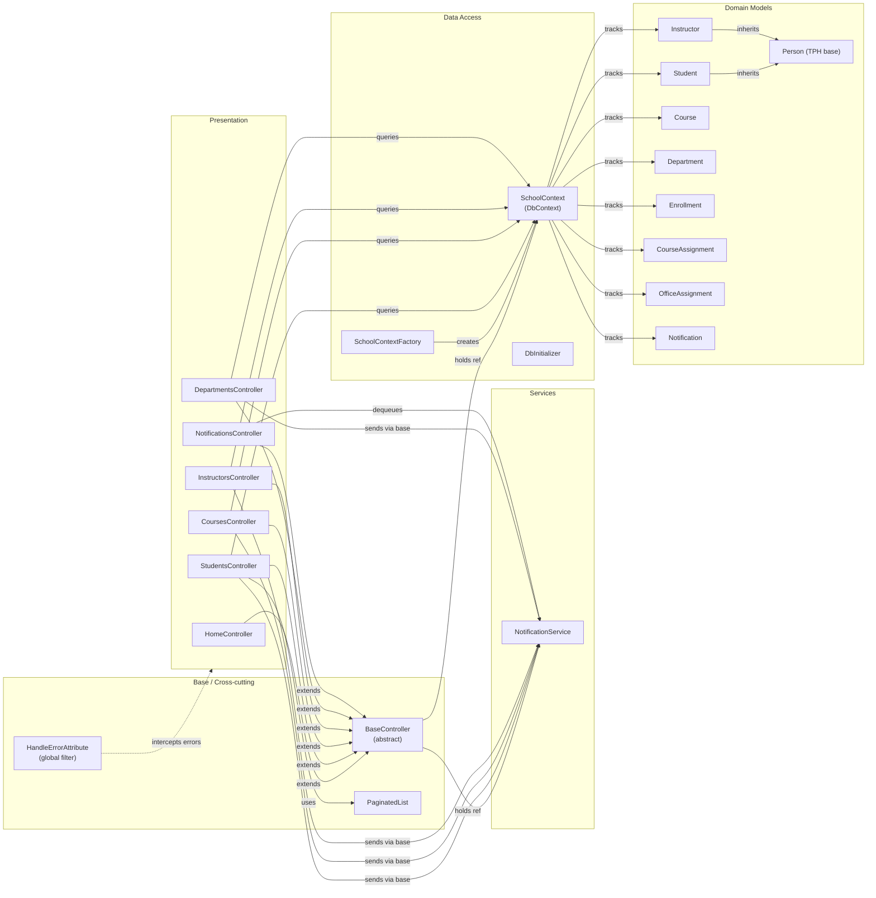

# Architecture Diagram

Contoso University is a classic ASP.NET MVC 5 web application targeting .NET Framework 4.8, using Entity Framework Core 3.1 for data access against SQL Server and MSMQ (System.Messaging) for asynchronous notifications.

## Application Architecture

### Technology Stack Summary

| Layer | Technology | Version | Purpose |
|---|---|---|---|
| Presentation | ASP.NET MVC 5 (Razor Views) | 5.2.9 | Server-side MVC web framework with Razor templating |
| Presentation | Bootstrap | 3.x (bundled) | Responsive CSS/JS UI framework |
| Presentation | jQuery | 3.4.1 | Client-side scripting and form validation |
| Application | .NET Framework | 4.8 | Runtime platform |
| Application | Newtonsoft.Json | 13.0.3 | JSON serialisation (notification messages) |
| Application | Microsoft.Extensions.Caching.Memory | 3.1.32 | In-process memory cache abstraction |
| Data Access | Entity Framework Core | 3.1.32 | ORM for SQL Server data access |
| Data Access | Microsoft.Data.SqlClient | 2.1.4 | SQL Server ADO.NET driver |
| Messaging | System.Messaging (MSMQ) | .NET Framework built-in | Asynchronous notification queue |
| Database | SQL Server / LocalDB | MSSQLLocalDB (dev) | Relational database for all domain data |

### Data Storage & External Services

The application uses a single **SQL Server** database (`ContosoUniversityNoAuthEFCore`) accessed exclusively through Entity Framework Core 3.1 via `SchoolContext`. The database stores all domain entities (Person/Student/Instructor using Table-per-Hierarchy, Course, Department, Enrollment, CourseAssignment, OfficeAssignment, Notification). For messaging, the application relies on **Microsoft Message Queue (MSMQ)** via the `System.Messaging` API — the `NotificationService` writes JSON-serialised `Notification` objects to a local private queue (`.\Private$\ContosoUniversityNotifications`) whenever CRUD operations occur on domain entities. There are no external cloud services or third-party APIs; the application is entirely self-contained within a Windows/IIS environment.

### Key Architectural Decisions

- **Direct DbContext access in controllers** — Controllers inherit from `BaseController`, which creates a `SchoolContext` through `SchoolContextFactory`. There is no repository or service layer for data access; EF Core queries are written directly in controller actions.
- **MSMQ-based asynchronous notifications** — Entity CRUD operations (create, update, delete) publish JSON messages to a local MSMQ private queue via `NotificationService`; `NotificationsController` dequeues and surfaces them to the admin UI via a JSON endpoint.
- **Table-per-Hierarchy (TPH) inheritance** — `Student` and `Instructor` share a single `Person` table with a `Discriminator` column, reducing join complexity at the cost of nullable columns.

## Component Relationships

### Component Inventory

| Component | Layer | Type | Responsibility |
|---|---|---|---|
| HomeController | Presentation | MVC Controller | Renders home, about, and contact pages; displays enrollment statistics |
| StudentsController | Presentation | MVC Controller | Full CRUD for students with search, sort, and pagination |
| CoursesController | Presentation | MVC Controller | Full CRUD for courses including department assignment |
| InstructorsController | Presentation | MVC Controller | Full CRUD for instructors with office and course assignments |
| DepartmentsController | Presentation | MVC Controller | Full CRUD for academic departments including budget management |
| NotificationsController | Presentation | MVC Controller | Exposes JSON endpoints to retrieve and mark MSMQ notifications; admin dashboard view |
| BaseController | Base | Abstract MVC Controller | Provides shared `SchoolContext` and `NotificationService` instances; exposes `SendEntityNotification` helper |
| HandleErrorAttribute | Base | Global MVC Filter | Catches unhandled exceptions application-wide and renders the Error view |
| PaginatedList | Base | Generic Utility | Wraps IQueryable results into pages for list views |
| NotificationService | Services | Service | Creates/ensures MSMQ private queue; serialises `Notification` objects to JSON and sends/receives messages |
| SchoolContext | Data Access | EF Core DbContext | Central data access unit-of-work; exposes DbSets for all domain entities; configures TPH and relationships via Fluent API |
| SchoolContextFactory | Data Access | Static Factory | Reads connection string from Web.config and constructs a configured `SchoolContext` instance |
| DbInitializer | Data Access | Static Seeder | Applies EF Core migrations and seeds initial data on application startup |
| Person | Domain Models | EF Entity (TPH base) | Shared base entity for Student and Instructor (ID, FirstMidName, LastName) |
| Student | Domain Models | EF Entity | Inherits Person; adds EnrollmentDate and Enrollments navigation |
| Instructor | Domain Models | EF Entity | Inherits Person; adds HireDate, CourseAssignments, and OfficeAssignment navigation |
| Course | Domain Models | EF Entity | Represents a course with credits and department; linked to Enrollments and CourseAssignments |
| Department | Domain Models | EF Entity | Academic department with budget, start date, and administrator (Instructor) |
| Enrollment | Domain Models | EF Entity | Junction entity linking Student to Course with a Grade |
| CourseAssignment | Domain Models | EF Entity | Junction entity linking Instructor to Course (composite PK) |
| OfficeAssignment | Domain Models | EF Entity | One-to-one with Instructor; stores office location |
| Notification | Domain Models | EF Entity + DTO | Represents an entity-change notification; stored in DB and transmitted via MSMQ as JSON |
