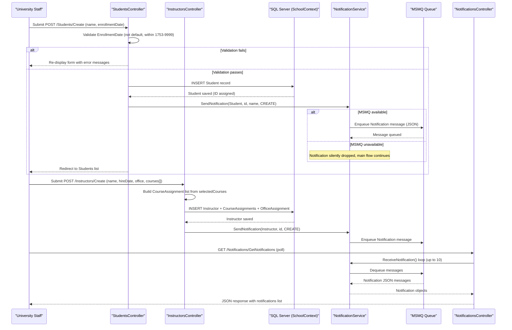

# Core Business Workflows

Contoso University is an ASP.NET MVC web application that enables university staff to manage academic records — including students, instructors, courses, departments, and enrollments — and delivers real-time operational notifications when records are created, updated, or deleted.

## Domain Entities

| Entity | Service / Bounded Context | Description | Key Relationships |
|---|---|---|---|
| Student | Academic Records – Student Management | A person enrolled at the university with an enrollment date | Inherits from Person; has many Enrollments |
| Instructor | Academic Records – Instructor Management | A university faculty member with a hire date | Inherits from Person; has many CourseAssignments; optionally has one OfficeAssignment |
| Person | Academic Records – Identity | Abstract base providing shared identity fields (name) for Student and Instructor using TPH inheritance | Parent of Student and Instructor |
| Course | Academic Records – Curriculum Management | An offered course belonging to a department, with credit value and optional teaching material image | Belongs to one Department; has many Enrollments; assigned to many Instructors via CourseAssignment |
| Department | Academic Records – Organizational Structure | An academic department with a budget and an optional administrator (Instructor) | Has many Courses; optionally has one administrating Instructor |
| Enrollment | Academic Records – Student Progress | Links a Student to a Course and records an optional grade (A–F) | Belongs to one Student and one Course |
| CourseAssignment | Academic Records – Teaching Assignments | Join entity that links an Instructor to a Course they teach | Belongs to one Instructor and one Course |
| OfficeAssignment | Academic Records – Instructor Facilities | Records the physical office location for an Instructor (optional, one-to-one) | Belongs to one Instructor |
| Notification | Notification Context | An audit event message generated when any domain entity is created, updated, or deleted | Standalone; references EntityType and EntityId by value (no FK) |

## Service-to-Domain Mapping

| Service | Domain Context | Owned Entities | External Dependencies |
|---|---|---|---|
| StudentsController | Student Management | Student, Enrollment (read) | SchoolContext (SQL Server via EF Core), NotificationService (MSMQ) |
| InstructorsController | Instructor Management | Instructor, OfficeAssignment, CourseAssignment | SchoolContext, NotificationService |
| CoursesController | Curriculum Management | Course, TeachingMaterial (file system) | SchoolContext, NotificationService, Server file system (~/Uploads/TeachingMaterials/) |
| DepartmentsController | Organizational Structure | Department | SchoolContext, NotificationService |
| NotificationsController | Notification Context | Notification (read from queue) | NotificationService (MSMQ) |
| HomeController | Reporting | EnrollmentDateGroup (aggregated view) | SchoolContext |
| NotificationService | Notification Context | Notification (queue messages) | MSMQ (System.Messaging), SchoolContext (Notification table) |

All modules share a single SQL Server database via a single `SchoolContext`. There are no inter-service REST calls; all cross-context data access is done through the shared DbContext. The Notification context communicates asynchronously through MSMQ.

## Primary Workflows

### Workflow 1: Student Registration

An administrator registers a new student by providing the student's name and enrollment date.

1. Staff submits POST /Students/Create with last name, first name, and enrollment date.
2. Controller validates the request: checks that `EnrollmentDate` is not the default/minimum value and falls within the valid SQL Server datetime range (1753–9999).
3. If `ModelState` is invalid, the form is re-displayed with error messages.
4. If valid, the Student record is persisted to the database via `SchoolContext`.
5. After a successful save, a `CREATE` notification is dispatched to MSMQ via `NotificationService`, including the student's display name.
6. Staff is redirected to the Students list, which supports search by name and sorting by name or enrollment date (paginated, 10 per page).

### Workflow 2: Instructor Onboarding with Course Assignments

An administrator hires a new instructor and assigns them to one or more courses.

1. Staff submits POST /Instructors/Create with last name, first name, hire date, optional office location, and a list of selected course IDs.
2. Controller iterates the `selectedCourses` array and builds a `CourseAssignment` collection linked to the new Instructor.
3. If `ModelState` is valid, the Instructor (with CourseAssignments) is persisted in a single `SaveChanges` call.
4. An `UPDATE` notification is sent to MSMQ.
5. When editing an existing instructor (POST /Instructors/Edit), `UpdateInstructorCourses` reconciles the selected courses against the current assignments: new assignments are added, removed selections are deleted (EntityState.Deleted).
6. If the office location is blank on edit, `OfficeAssignment` is set to null (cleared).

### Workflow 3: Course Creation with Teaching Material Upload

An administrator creates a course and optionally attaches a teaching material image.

1. Staff submits POST /Courses/Create with course number, title, credits, department, and an optional image file.
2. If an image is provided, the controller validates file type (jpg, jpeg, png, gif, bmp) and file size (max 5 MB).
3. A unique filename is generated using the course ID and a GUID, and the file is saved to `~/Uploads/TeachingMaterials/` on the server file system.
4. The Course record (with `TeachingMaterialImagePath`) is persisted to the database.
5. A `CREATE` notification is dispatched to MSMQ.
6. On course deletion, the associated image file is deleted from the file system before the Course record is removed from the database.

### Workflow 4: Department Management with Concurrency Control

An administrator creates or modifies a department, assigning an instructor as administrator.

1. Staff submits POST /Departments/Create or Edit with department name, budget, start date, and optional administrator (Instructor).
2. On edit, the `RowVersion` (timestamp) field is included in the form to enable optimistic concurrency.
3. If another user has modified the same department record concurrently, a `DbUpdateConcurrencyException` is caught. The controller reads current database values and exposes field-level conflict messages to the user for each changed field (Name, Budget, StartDate, InstructorID).
4. Staff must confirm the save with the refreshed `RowVersion` to proceed.
5. On success, a `CREATE` or `UPDATE` notification is dispatched to MSMQ.
6. Instructor deletion triggers a cleanup: any Department that references the deleted instructor as administrator has its `InstructorID` set to null before saving.

### Workflow 5: Notification Polling and Review

An administrator reviews recent system activity via the notification dashboard.

1. The browser polls GET /Notifications/GetNotifications (JSON endpoint).
2. The controller calls `NotificationService.ReceiveNotification()` in a loop, dequeuing up to 10 messages from MSMQ.
3. Each dequeued message is a JSON-serialized `Notification` with entity type, entity ID, operation (CREATE/UPDATE/DELETE), human-readable message, timestamp, and creator.
4. The JSON response is returned to the browser for rendering in the notification panel.
5. Staff can mark individual notifications as read via POST /Notifications/MarkAsRead.

### Workflow 6: Enrollment Statistics Report

The About page provides a summary of student enrollment grouped by date.

1. Staff navigates to GET /Home/About.
2. The controller queries `SchoolContext.Students`, groups them by `EnrollmentDate`, and projects the count per date into `EnrollmentDateGroup` view models.
3. The result is rendered as a statistics table.

## Cross-Service Data Flows

This application uses a **monolithic single-database architecture** — all bounded contexts (Student, Instructor, Curriculum, Organizational) share the same `SchoolContext` and SQL Server database. There is no inter-service REST composition or API gateway aggregation pattern.

The one cross-context data flow is the **Instructor → Department administrator** relationship: when displaying or editing a Department, the InstructorsController and DepartmentsController both load Instructor data from the shared context to populate administrator selection lists. When an Instructor is deleted, the DepartmentsController sets the referencing Department's `InstructorID` to null to maintain referential integrity in the same transaction.

The **Notification side-channel** is the only asynchronous cross-context flow: every domain controller (Students, Instructors, Courses, Departments) publishes messages to MSMQ via `NotificationService` after a successful database write. The `NotificationsController` consumes from the same MSMQ queue, decoupling the write path from the notification display path. If MSMQ is unavailable, the notification dispatch fails silently (exceptions are caught and logged with `Debug.WriteLine`), ensuring the main operation is not interrupted.

## Business Workflow Sequence

## Business Rules & Decision Logic

### Validation Rules

- **Student / Instructor EnrollmentDate and HireDate**: Required; must not be `DateTime.MinValue` or the default value; must fall within the SQL Server datetime range of 1753-01-01 to 9999-12-31.
- **Person names (LastName, FirstMidName)**: Required; maximum 50 characters each.
- **Course title**: Required; 3–50 characters.
- **Course credits**: Integer in range 0–5.
- **Department name**: Required; 3–50 characters.
- **Teaching material image**: Optional; file extension must be one of `.jpg`, `.jpeg`, `.png`, `.gif`, `.bmp`; file size must not exceed 5 MB.

### Decision Logic

- **Course image replacement**: On Course edit, if a new image is uploaded and a previous `TeachingMaterialImagePath` exists, the old file is deleted from the file system before saving the new file.
- **Course image cleanup on deletion**: When a Course is deleted, the associated teaching material image file is removed from the file system. Failure to delete the file is logged but does not block course deletion.
- **Instructor office assignment removal**: If the office location field is blank or whitespace on Instructor edit, the `OfficeAssignment` entity is set to null (deleted).
- **Course assignment reconciliation**: On Instructor edit, the system compares the submitted `selectedCourses` array to current assignments: missing entries are added as new `CourseAssignment` records; deselected entries are marked `EntityState.Deleted`.
- **Department administrator cleanup on instructor deletion**: When an Instructor is deleted, any Department that references that instructor as administrator has its `InstructorID` set to null in the same transaction.
- **Notification suppression**: Notification dispatch errors are caught silently so that failures in the MSMQ path never cause the primary database operation to roll back or the user to see an error.

### State Transitions

- **Notification**: Created (enqueued in MSMQ) → Received (dequeued by NotificationsController) → Read (MarkAsRead called). Note: the read state is acknowledged in-memory only; no persistent read-tracking is implemented in the current codebase.

### Concurrency Control

- **Department optimistic concurrency**: The `Department` entity carries a `RowVersion` (SQL Server `timestamp`) column. On edit, if a `DbUpdateConcurrencyException` is thrown, the controller reads current database values, computes per-field differences, and surfaces them to the user with a message prompting them to review and resubmit. The updated `RowVersion` is returned in the form to allow the user to force-save with awareness of the concurrent change.

### Cross-Cutting Concerns

- **Error handling**: Domain controllers wrap write operations in `try/catch`; on failure, a generic error message is added to `ModelState` and the form is re-displayed. For deletions, a `TempData["ErrorMessage"]` is set and the user is redirected to the list view.
- **Audit logging**: Every successful CREATE, UPDATE, or DELETE operation dispatches a structured `Notification` message to MSMQ recording the entity type, entity ID, display name, operation, timestamp, and actor (defaulting to "System" as the application has no authentication layer).
- **Anti-forgery**: All POST actions are protected with `[ValidateAntiForgeryToken]`.
- **Pagination**: The Students list applies server-side pagination via `PaginatedList<T>` with a fixed page size of 10.
