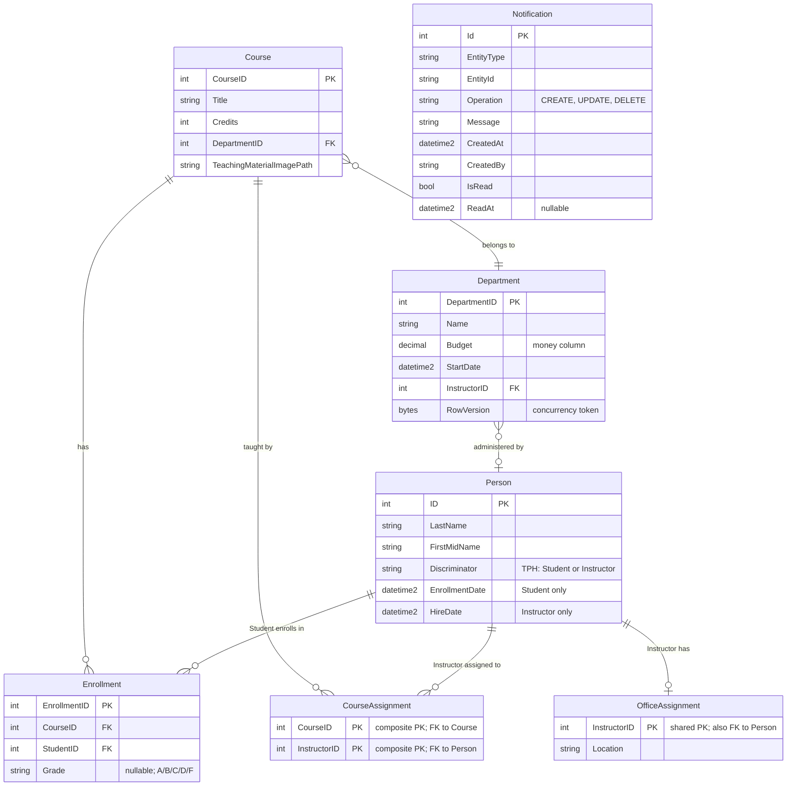

# Data Architecture & Persistence Layer

This application uses a single SQL Server database accessed via EF Core 3.1 (`SchoolContext`), mapping 9 entities across the university domain — students, instructors, courses, departments, enrollments, and notifications.

## Database Configuration

| Service/Module | DB Type | Profile | Driver | Connection | Migration Tool |
|---|---|---|---|---|---|
| ContosoUniversity (default) | SQL Server (LocalDB) | Default (all environments) | `Microsoft.Data.SqlClient` 2.1.4 via `Microsoft.EntityFrameworkCore.SqlServer` 3.1.32 | `(LocalDb)\MSSQLLocalDB`, catalog `ContosoUniversityNoAuthEFCore`, Integrated Security, MARS enabled | None — EF Core `EnsureCreated()` creates schema; `DbInitializer.Initialize()` seeds data programmatically at startup |

> Schema is created automatically by EF Core on first run via `EnsureCreated()`. No Flyway, Liquibase, or EF Migrations are configured. Seed data is applied only when the Students table is empty. See `configuration-inventory.md` for the full property inventory.

## Data Ownership per Service

| Service | Tables Owned | ORM Framework | Caching | Notes |
|---|---|---|---|---|
| ContosoUniversity (monolith) | Person (TPH: Student, Instructor), Course, Department, Enrollment, OfficeAssignment, CourseAssignment, Notification | EF Core 3.1 (`SchoolContext`) | None | Single shared `SchoolContext`; all controllers instantiate via `SchoolContextFactory.Create()`; `Microsoft.Extensions.Caching.Memory` package is present but not used at runtime |

## Entity Model

**Inheritance:** `Person` uses Table-per-Hierarchy (TPH). `Student` and `Instructor` share the `Person` table, differentiated by a `Discriminator` column. `Student` adds `EnrollmentDate`; `Instructor` adds `HireDate`.

**Concurrency:** `Department.RowVersion` (`[Timestamp]`) enables optimistic concurrency detection; `DbUpdateConcurrencyException` is handled in `DepartmentsController`.

**Transaction management:** No explicit `TransactionScope` or `BeginTransaction` calls. All writes use `db.SaveChanges()` on `SchoolContext`, relying on EF Core's implicit transaction-per-save-changes.

## Key Repository Methods

There are no dedicated repository interfaces; all data access is performed directly on `SchoolContext.DbSet<T>` properties within controllers.

| Controller | DbSet / Entity | Notable Data Access Patterns | Purpose |
|---|---|---|---|
| `StudentsController` | `db.Students` | `Include(s => s.Enrollments).ThenInclude(e => e.Course).Where(s => s.ID == id)` | Eager-loads student enrollments with course details for Details view |
| `StudentsController` | `db.Students` | LINQ `Where` with `Contains` on `LastName`/`FirstMidName`; `OrderBy`/`OrderByDescending` | Search and sort in paginated index; paginated via `PaginatedList<Student>` |
| `InstructorsController` | `db.Instructors` | `Include(i => i.OfficeAssignment).Include(i => i.CourseAssignments).ThenInclude(c => c.Course).ThenInclude(d => d.Department)` | Multi-level eager load for instructor index with office and course/department data |
| `InstructorsController` | `db.Instructors` | `UpdateInstructorCourses` — iterates `db.Courses`, diffs against `HashSet<int>` of current assignments, adds/marks-Deleted `CourseAssignment` entries | Synchronises many-to-many course assignments for an instructor on edit |
| `InstructorsController` | `db.Departments` | `Where(d => d.InstructorID == id).SingleOrDefault()` | Nullifies `Department.InstructorID` when the administering instructor is deleted |
| `CoursesController` | `db.Courses` | `Include(c => c.Department)` | Eager-loads Department for course list and details views |
| `DepartmentsController` | `db.Departments` | `Include(d => d.Administrator)` | Eager-loads administering Instructor for departments index |
| `HomeController` | `db.Students` | LINQ `group student by student.EnrollmentDate` | Groups students by enrollment date for the About/statistics page |
| `NotificationsController` | — | Reads from MSMQ via `NotificationService.ReceiveNotification()`; `Notification` model used as DTO | Retrieves queued notifications; `Notification` table in `SchoolContext` is defined but not queried at runtime |

## Caching Strategy

No caching layer is active at runtime. `Microsoft.Extensions.Caching.Memory` (v3.1.32) and `Microsoft.Extensions.Caching.Abstractions` are listed in `packages.config` but are not injected into any controller or service. There are no `[OutputCache]`, `IMemoryCache`, `IDistributedCache`, or second-level EF Core cache configurations in the codebase.

Every request executes a fresh `DbContext` instance (created by `SchoolContextFactory.Create()`) and issues live SQL queries against SQL Server LocalDB.

## Data Ownership Boundaries

**Shared data store:** All entities reside in a single SQL Server LocalDB database (`ContosoUniversityNoAuthEFCore`). There is no database-per-service or logical schema separation — this is a monolithic application with a single `SchoolContext` shared across all controllers.

**Cross-service access:** All controllers inherit `BaseController`, which instantiates `SchoolContext` directly via `SchoolContextFactory.Create()`. There is no service layer or repository abstraction; controllers access all tables directly. Cross-entity aggregation (e.g., joining instructors → courses → departments → enrollments) is handled in-process via EF Core `Include`/`ThenInclude` chains.

**Notification boundary:** `Notification` is modelled as a `DbSet<Notification>` in `SchoolContext`, but runtime notifications are dispatched and consumed exclusively through MSMQ (`NotificationService` → `System.Messaging.MessageQueue`). The database table is defined for potential persistence but is not written or read by any current code path.

**Read/write patterns:** Standard CRUD; no CQRS separation. All reads and writes share the same `SchoolContext`. Optimistic concurrency is applied only to the `Department` entity via `RowVersion`.

### Data Classification & Sensitivity

| Entity | Sensitive Fields | Classification | Controls in Place |
|---|---|---|---|
| Person (Student) | `FirstMidName`, `LastName`, `EnrollmentDate` | PII | None — no encryption-at-rest, masking, or field-level access controls configured |
| Person (Instructor) | `FirstMidName`, `LastName`, `HireDate` | PII | None — no encryption-at-rest, masking, or field-level access controls configured |
| Notification | `CreatedBy`, `Message` (may contain entity names) | PII (indirect) | None — notifications are transient in MSMQ; no persistence controls |
| Course, Department, Enrollment, OfficeAssignment, CourseAssignment | No personal data | None / Internal | N/A |

> **Risk note:** `Person` (Student and Instructor) stores personally identifiable information — full names and key dates — without encryption-at-rest or masking. The application has no authentication or authorization layer, meaning all PII is accessible to any user reaching the application.
