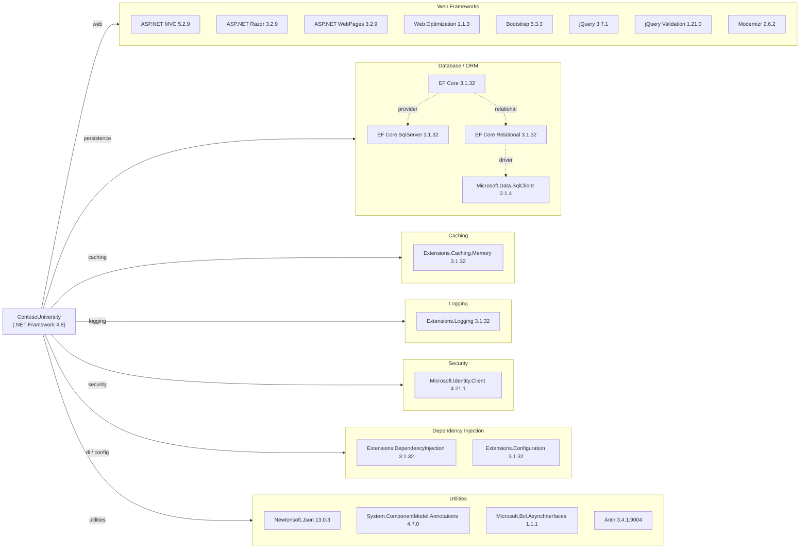

# Dependency Map

ContosoUniversity is an ASP.NET MVC 5 web application targeting .NET Framework 4.8, with 47 declared external dependencies managed via NuGet (`packages.config`).

## Dependencies

### Dependency Summary

| Category | Count | Key Libraries | Notes |
|----------|-------|---------------|-------|
| Web Frameworks | 8 | ASP.NET MVC 5.2.9, Razor 3.2.9, Bootstrap 5.3.3, jQuery 3.7.1 | Legacy MVC stack on .NET Framework; not portable to .NET 8 without migration |
| Database / ORM | 7 | EF Core 3.1.32, EF Core SqlServer 3.1.32, Microsoft.Data.SqlClient 2.1.4 | EF Core 3.1 is end-of-life; mixed use of EF Core on classic .NET Framework |
| Caching | 2 | Extensions.Caching.Memory 3.1.32 | In-memory only; no distributed cache |
| Logging | 2 | Extensions.Logging 3.1.32 | Abstractions only; no concrete sink configured via NuGet |
| Security | 1 | Microsoft.Identity.Client 4.21.1 | MSAL 4.21.1 is outdated (current is 4.x latest); basic identity integration |
| Dependency Injection | 7 | Extensions.DependencyInjection 3.1.32, Extensions.Configuration 3.1.32 | .NET Core DI/config extensions back-ported to .NET Framework |
| Utilities | 15 | Newtonsoft.Json 13.0.3, System.* compatibility packages, Antlr 3.4.1.9004 | Several System.* shim packages exist only to support .NET Standard libs on .NET Framework |

### Version & Compatibility Risks

The application targets **.NET Framework 4.8**, which is in long-term maintenance mode with no new feature development. **Entity Framework Core 3.1.32** reached end-of-life in December 2022 and is being used unconventionally — EF Core was designed for .NET Core/.NET 5+ and is back-ported here onto .NET Framework 4.8 via `netstandard2.0` binaries, creating a fragile setup. **ASP.NET MVC 5.2.9** is the legacy `System.Web`-based MVC stack that cannot be lifted to modern .NET without a full migration to ASP.NET Core MVC. **Microsoft.Identity.Client 4.21.1** is significantly behind the current release line (4.60+), which includes important security and reliability fixes. Multiple `System.*` shim packages (e.g., `System.Buffers`, `System.Memory`, `System.Threading.Tasks.Extensions`) are present solely to bridge .NET Standard 2.0 library requirements on .NET Framework, adding dependency noise that disappears on .NET 8+.

### Notable Observations

- **Mixed EF Core on .NET Framework**: Using EF Core 3.1 (a .NET Core-era library) on top of .NET Framework 4.8 is an uncommon and unsupported combination that can cause subtle runtime issues; migrating to .NET 8 would allow upgrading to EF Core 8 or EF Core 9 natively.
- **No distributed caching**: Only `Extensions.Caching.Memory` is declared; there is no Redis or SQL-backed distributed cache, limiting horizontal scalability.
- **Frontend tooling is dated**: Modernizr 2.6.2 (circa 2013) and WebGrease 1.5.2 (a now-abandoned CSS/JS bundling tool) are obsolete; modern frontend builds use Webpack, Vite, or similar.
- **Antlr 3.4.1.9004 is a transitive dependency of WebGrease**: It serves no direct application purpose and is included only to support the legacy `System.Web.Optimization` bundler, adding unnecessary surface area.

## Test Dependencies

| Framework | Version | Notes |
|-----------|---------|-------|
| — | — | No test packages detected |

Total test-scope dependencies: 0

No test dependencies were detected in `packages.config` or `ContosoUniversity.csproj`. The project has no NuGet-declared testing framework (xUnit, MSTest, NUnit, Moq, etc.), indicating either a separate test project is not present in this repository, or tests have not yet been introduced.
