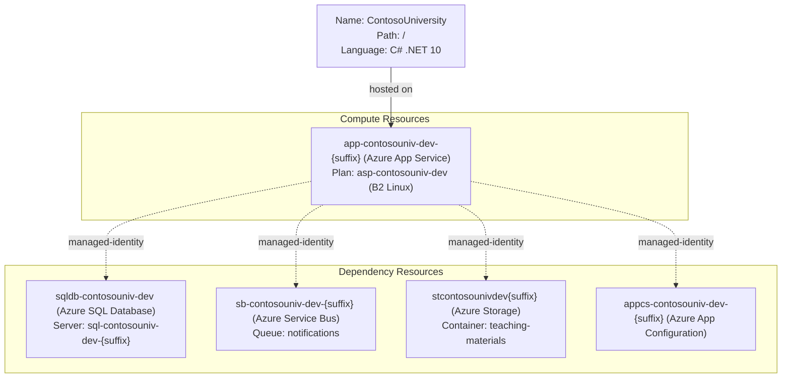

# Azure Deployment Plan for ContosoUniversity

## **Goal**
Deploy the modernized ContosoUniversity .NET 10 ASP.NET Core MVC application to Azure App Service (Linux) in resource group `rg-contosouniv-dev` using the Bicep-provisioned infrastructure and Azure CLI.

---

## **Project Information**

**ContosoUniversity**
- **Stack**: ASP.NET Core MVC — .NET 10 (`net10.0`)
- **Type**: University course/student management web application
- **Containerization**: No Dockerfile — deployed via `az webapp deploy` zip-deploy
- **Authentication**: Microsoft Entra ID (OIDC via `Microsoft.Identity.Web`)
- **Dependencies**:
  - Azure SQL Database — Managed Identity (`Authentication=Active Directory Default`)
  - Azure Service Bus — Managed Identity (`DefaultAzureCredential`)
  - Azure Storage Blob — Managed Identity (`DefaultAzureCredential`)
  - Azure App Configuration — Managed Identity (`DefaultAzureCredential`)
- **Hosting**: Azure App Service (Linux, .NET 10, B2 SKU)

---

## **Azure Resources Architecture**

> **Install the mermaid extension in IDE to view the architecture.**



---

## **Existing Azure Resources**

| Resource Type            | Name Pattern                          | SKU / Tier       | Purpose                                      |
|--------------------------|---------------------------------------|------------------|----------------------------------------------|
| Azure App Service Plan   | `asp-contosouniv-dev`                 | B2 Linux         | Hosts the web application                    |
| Azure Web App            | `app-contosouniv-dev-{suffix}`        | .NET 10 Linux    | Runs ContosoUniversity MVC app               |
| Azure SQL Server         | `sql-contosouniv-dev-{suffix}`        | Standard         | Relational database backend                  |
| Azure SQL Database       | `sqldb-contosouniv-dev`               | Serverless       | ContosoUniversity schema and data            |
| Azure Service Bus NS     | `sb-contosouniv-dev-{suffix}`         | Standard         | Notification queue messaging                 |
| Azure Storage Account    | `stcontosounivdev{suffix}`            | Standard_LRS     | Teaching material blob storage               |
| Azure App Configuration  | `appcs-contosouniv-dev-{suffix}`      | Free             | Externalized non-secret app settings         |

**Missing resources:** None — all resources provisioned by task `008-infrastructure-bicep`.

---

## **Execution Steps**

> **Below are the steps for Copilot to follow. Add check list for the steps.**
> **CRITICAL: Do NOT run `az login` until 'Env setup' step.**

### Step 1 — Env Setup for AzCLI
- [ ] 1.1 Verify AZ CLI is installed (`az --version`)
- [ ] 1.2 Run `az login` and confirm authenticated session
- [ ] 1.3 Confirm or set the active subscription (`az account show`)
- [ ] 1.4 Set the resource group context: `rg-contosouniv-dev`
- [ ] 1.5 Install the serviceconnector-passwordless extension:
  ```bash
  az extension add --name serviceconnector-passwordless --upgrade
  ```

### Step 2 — Check Azure Resources Existence
- [ ] 2.1 Resolve the exact Web App name (suffix) via:
  ```bash
  az webapp list --resource-group rg-contosouniv-dev --query "[].name" -o tsv
  ```
- [ ] 2.2 Verify Web App exists:
  ```bash
  az webapp show --name <webAppName> --resource-group rg-contosouniv-dev -o json
  ```
  - Expected: `provisioningState: Succeeded`, `kind: app,linux`, `state: Running`
- [ ] 2.3 Verify Azure SQL Database exists:
  ```bash
  az sql db show --server <sqlServerName> --name sqldb-contosouniv-dev --resource-group rg-contosouniv-dev -o json
  ```
- [ ] 2.4 Verify Service Bus namespace exists:
  ```bash
  az servicebus namespace show --name <serviceBusName> --resource-group rg-contosouniv-dev -o json
  ```
- [ ] 2.5 Verify Storage Account exists:
  ```bash
  az storage account show --name <storageAccountName> --resource-group rg-contosouniv-dev -o json
  ```
- [ ] 2.6 Verify App Configuration store exists:
  ```bash
  az appconfig show --name <appConfigName> --resource-group rg-contosouniv-dev -o json
  ```
- [ ] 2.7 If any resource is missing → provision via Bicep (task 008 scripts: `infra/deploy.ps1`)

### Step 3 — Build and Package Application
- [ ] 3.1 Run `dotnet publish` to produce a self-contained release package:
  ```bash
  dotnet publish ContosoUniversity.csproj -c Release -o ./publish
  ```
- [ ] 3.2 Zip the publish output:
  ```powershell
  Compress-Archive -Path ./publish/* -DestinationPath ./publish/app.zip -Force
  ```

### Step 4 — Seed Azure App Configuration
- [ ] 4.1 Seed key-values from `.azure/configuration-migration.json` into App Configuration:
  ```bash
  az appconfig kv import --name <appConfigName> --resource-group rg-contosouniv-dev \
    --source file --path .azure/configuration-migration.json --format json --yes
  ```
  > Update placeholder values (AzureAd TenantId, ClientId, Domain, Service Bus FQDN, Storage URI) with actual provisioned resource endpoints before seeding.

### Step 5 — Configure App Service Settings
- [ ] 5.1 Set `AZURE_APP_CONFIGURATION_ENDPOINT` and connection/identity app settings:
  ```bash
  az webapp config appsettings set \
    --name <webAppName> \
    --resource-group rg-contosouniv-dev \
    --settings \
      ASPNETCORE_ENVIRONMENT=Development \
      AZURE_APP_CONFIGURATION_ENDPOINT=<appConfigEndpoint> \
      ConnectionStrings__DefaultConnection="Server=tcp:<sqlFqdn>;Database=sqldb-contosouniv-dev;Authentication=Active Directory Default;" \
      AzureServiceBus__FullyQualifiedNamespace=<serviceBusFqdn> \
      AzureServiceBus__QueueName=notifications \
      Storage__ServiceUri=<blobEndpoint> \
      Storage__ContainerName=teaching-materials
  ```

### Step 6 — Deploy Application
- [ ] 6.1 Deploy the zip package to Azure App Service:
  ```bash
  az webapp deploy \
    --name <webAppName> \
    --resource-group rg-contosouniv-dev \
    --src-path ./publish/app.zip \
    --type zip \
    --async false
  ```
- [ ] 6.2 Restart the Web App to pick up all settings:
  ```bash
  az webapp restart --name <webAppName> --resource-group rg-contosouniv-dev
  ```

### Step 7 — Deployment Validation
- [ ] 7.1 Call tool `appmod-get-app-logs` to check application logs
- [ ] 7.2 Call tool `appmod-debug-app-in-browser` to validate the application is reachable via HTTPS

### Step 8 — Summarize Result
- [ ] 8.1 Call tool `appmod-summarize-result` to summarize the deployment result
- [ ] 8.2 Generate `deployment-summary.md`

---

## **Progress Tracking**

Progress is tracked in `progress.md` alongside this plan.
