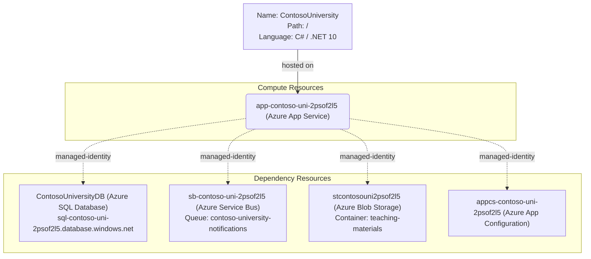

# Azure Deployment Plan for ContosoUniversity Project

## **Goal**
Deploy the ContosoUniversity .NET 10 ASP.NET Core MVC application to Azure App Service in resource group `app-mod-cli-full-uni` under subscription `94bc45db-2c21-4a0e-a881-762c4d44751a` using Azure CLI.

## **Project Information**

**ContosoUniversity**
- **Stack**: ASP.NET Core MVC (.NET 10 / net10.0)
- **Type**: University management web app (students, courses, instructors, departments)
- **Containerization**: No Dockerfile — deploying via `az webapp deploy` (ZIP deploy)
- **Dependencies**:
  - Azure SQL Database (EF Core + Managed Identity / Active Directory Default)
  - Azure Service Bus (notifications queue via Managed Identity)
  - Azure Blob Storage (teaching material uploads via Managed Identity)
  - Azure App Configuration (externalised non-secret settings via Managed Identity)
  - Microsoft Entra ID (user authentication via Microsoft.Identity.Web)
- **Hosting**: Azure App Service (Linux, B2 tier, SwedenCentral)

## **Azure Resources Architecture**

> **Install the mermaid extension in IDE to view the architecture.**

## **Existing Azure Resources**

| Resource Type | Name | SKU | Purpose |
|---------------|------|-----|---------|
| App Service Plan | `asp-contoso-uni-prod` | Linux B2 Basic | Hosts the App Service |
| App Service | `app-contoso-uni-2psof2l5` | Linux B2 | Hosts ContosoUniversity web app |
| Azure SQL Server | `sql-contoso-uni-2psof2l5` | — | Database server |
| Azure SQL Database | `ContosoUniversityDB` | — | Application database |
| Service Bus Namespace | `sb-contoso-uni-2psof2l5` | — | Notification queue |
| Service Bus Queue | `contoso-university-notifications` | — | Async notifications |
| Storage Account | `stcontosouni2psof2l5` | — | Teaching material blobs |
| Blob Container | `teaching-materials` | — | Upload container |
| App Configuration | `appcs-contoso-uni-2psof2l5` | — | Externalised app settings |

**Missing resources**
None — all required resources are provisioned.

## **Execution Steps**

> **Below are the steps for Copilot to follow. Add check list for the steps.**
> **CRITICAL: Do NOT run 'az login' until 'Env setup' step.**

1. Env setup for AzCLI:
   - [ ] Install AZ CLI if not installed
   - [ ] Ensure there is a default subscription set; override with subscription ID `94bc45db-2c21-4a0e-a881-762c4d44751a`
   - [ ] Install Service Connector AzCLI extension: `az extension add --name serviceconnector-passwordless --upgrade`

2. Check Azure resources existence:
   - [ ] Azure App Service for `app-contoso-uni-2psof2l5`:
     - name: `app-contoso-uni-2psof2l5`, resource group: `app-mod-cli-full-uni`, subscription: `94bc45db-2c21-4a0e-a881-762c4d44751a`
     - Check with `az webapp show -o json`
   - [ ] Azure SQL Database `ContosoUniversityDB` on server `sql-contoso-uni-2psof2l5`
   - [ ] Service Bus namespace `sb-contoso-uni-2psof2l5`, queue `contoso-university-notifications`
   - [ ] Storage account `stcontosouni2psof2l5`, container `teaching-materials`
   - [ ] App Configuration `appcs-contoso-uni-2psof2l5`
   - [ ] Create missing resources: N/A — all resources already provisioned

3. Deployment:
   - [ ] Configure App Service application settings (env vars / connection strings)
   - [ ] Seed Azure App Configuration with key-values from `.azure/configuration-migration.json`
   - [ ] Build and publish the .NET 10 application (`dotnet publish`)
   - [ ] ZIP and deploy via `az webapp deploy`
   - [ ] Deployment Validation:
     - [ ] Call tool `appmod-get-app-logs` to check application logs
     - [ ] Call tool `appmod-debug-app-in-browser` to verify the app is reachable

4. Summarize Result:
   - [ ] Call tool `appmod-summarize-result` to summarize the deployment result
   - [ ] Generate `deployment-summary.md`

## **Progress Tracking**

See `progress.md` for real-time status of each step.

## **Tools Checklist**

- [ ] appmod-summarize-result
